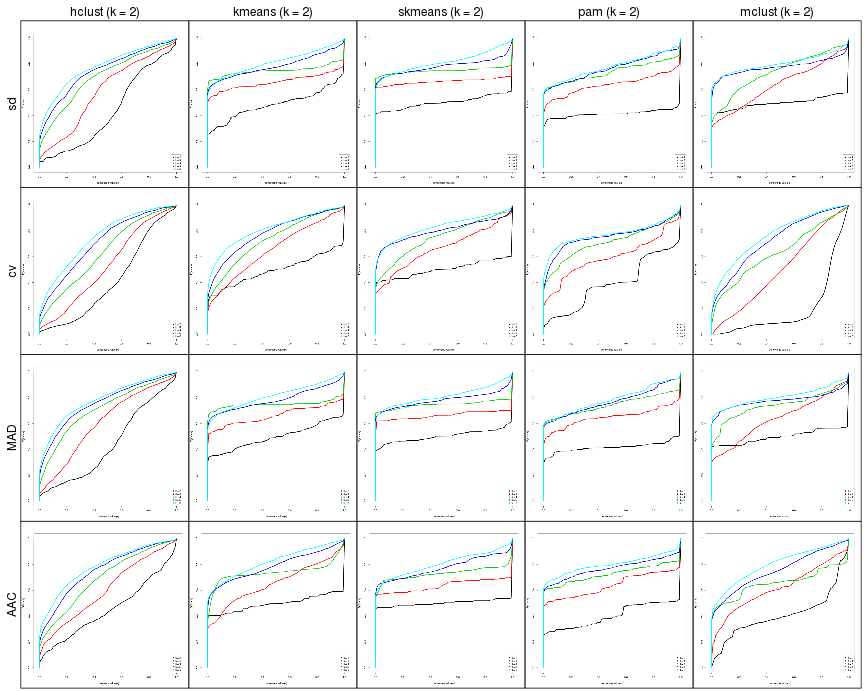

Cola report
==================

**Date**: 2018-11-21

----------------------------------------------------------------

<style type='text/css'>
#toc {
  position: fixed;
  left: 0;
  top: 20px;
  width: 200px;
  height: 100%;
  overflow:auto;
  padding: 0px 10px 0px 10px;
}
#toc_header {
  display: none;
}
#toc ul {
  margin: 0px;
  padding: 0px;
}
#toc ul li {
  list-style-type: none;
}

#toc ul li ul li {
  margin-left: 15px;
  list-style-type: circle;
}
body, td, th {
   font-family: Arial,Helvetica,sans-serif;
   background-color: white;
   font-size: 13px;
  max-width: 800px;
  margin: auto;
  margin-left:210px;
  padding: 0px 10px 0px 10px;
  border-left: 1px solid #EEEEEE;
  line-height: 150%;
}

tt, code, pre {
   font-family: 'DejaVu Sans Mono', 'Droid Sans Mono', 'Lucida Console', Consolas, Monaco, 

monospace;
}

h1 {
   font-size:2.2em;
}

h2 {
   font-size:1.8em;
}

h3 {
   font-size:1.4em;
}

h4 {
   font-size:1.0em;
}

h5 {
   font-size:0.9em;
}

h6 {
   font-size:0.8em;
}

a {
  text-decoration: none;
}

a:hover {
  text-decoration: underline;
}

a:visited {
   color: rgb(50%, 0%, 50%);
}

pre, img {
  max-width: 100%;
}
pre {
  overflow-x: auto;
}
pre code {
   display: block; padding: 0.5em;
}

code {
  font-size: 92%;
  border: 1px solid #ccc;
}

code[class] {
  background-color: #F8F8F8;
}

table, td, th {
  border: 1px solid #ccc;
}

blockquote {
   color:#666666;
   margin:0;
   padding-left: 1em;
   border-left: 0.5em #EEE solid;
}

hr {
   height: 0px;
   border-bottom: none;
   border-top-width: thin;
   border-top-style: dotted;
   border-top-color: #999999;
}

@media print {
   * {
      background: transparent !important;
      color: black !important;
      filter:none !important;
      -ms-filter: none !important;
   }

   body {
      font-size:12pt;
      max-width:100%;
   }

   a, a:visited {
      text-decoration: underline;
   }

   hr {
      visibility: hidden;
      page-break-before: always;
   }

   pre, blockquote {
      padding-right: 1em;
      page-break-inside: avoid;
   }

   tr, img {
      page-break-inside: avoid;
   }

   img {
      max-width: 100% !important;
   }

   @page :left {
      margin: 15mm 20mm 15mm 10mm;
   }

   @page :right {
      margin: 15mm 10mm 15mm 20mm;
   }

   p, h2, h3 {
      orphans: 3; widows: 3;
   }

   h2, h3 {
      page-break-after: avoid;
   }
}
</style>


## Summary


First the variable name is changed to `res_list`.


```r
res_list = rl
```


All available functions which can be applied to this `res_list` object:


```r
res_list
```

```
#> A 'ConsensusPartitionList' object with 20 methods.
#>   On a matrix with 11268 rows and 173 columns.
#>   Top rows are extracted by 'sd, cv, MAD, AAC' methods.
#>   Subgroups are detected by 'hclust, kmeans, skmeans, pam, mclust' method.
#>   Number of partitions are tried for k = 2, 3, 4, 5, 6.
#>   Performed in total 20000 partitions.
#> 
#> Following methods can be applied to this 'ConsensusPartitionList' object:
#>  [1] "cola_report"           "collect_classes"       "collect_plots"         "get_anno_col"         
#>  [5] "get_anno"              "get_classes"           "get_matrix"            "get_membership"       
#>  [9] "get_stat"              "guess_best_k"          "show"                  "test_to_known_factors"
#> [13] "top_rows_heatmap"      "top_rows_overlap"     
#> 
#> You can get result for a single method by its node id, e.g. object["sd", "hclust"] or object["sd:hclust"]
#> or a subset of methods by object[c("sd", "cv")], c("hclust", "kmeans")]
```

The call of `run_all_consensus_partition_methods()` was:


```
#> run_all_consensus_partition_methods(data = data, max_k = 6, top_n = c(1000, 
#>     2000, 3000, 4000), mc.cores = 4, anno = data.frame(subtype = subtype), 
#>     anno_col = list(subtype = structure(seq_len(4), names = unique(subtype))))
```

Dimension of the input matrix:


```r
mat = get_matrix(res_list)
dim(mat)
```

```
#> [1] 11268   173
```

The density distribution for each sample is visualized as heatmap as one column in follwing plot:


```r
library(ComplexHeatmap)
densityHeatmap(mat, top_annotation = HeatmapAnnotation(df = get_anno(res_list), 
	col = get_anno_col(res_list)), ylab = "value", cluster_columns = TRUE, show_column_names = FALSE)
```


`res_list` contains results for 	


Best `k` (number of partitions) for each combination of top value methods and partition methods:


```r
guess_best_k(res_list)
```


|                       | best_k| cophcor|   PAC| mean_silhouette| concordance|   |
|:----------------------|------:|-------:|-----:|---------------:|-----------:|:--|
|[sd:skmeans](#toc_5)   |      4|   0.995| 0.037|           0.960|       0.982|** |
|[sd:mclust](#toc_7)    |      2|   0.988| 0.087|           0.956|       0.982|** |
|[MAD:kmeans](#toc_14)  |      4|   0.996| 0.023|           0.959|       0.979|** |
|[MAD:skmeans](#toc_15) |      4|   0.994| 0.049|           0.948|       0.976|** |
|[cv:skmeans](#toc_10)  |      2|   0.981| 0.134|           0.934|       0.973|** |
|[sd:kmeans](#toc_4)    |      4|   0.992| 0.054|           0.933|       0.968|** |
|[AAC:skmeans](#toc_20) |      4|   0.984| 0.081|           0.910|       0.958|** |
|[MAD:pam](#toc_16)     |      3|   0.984| 0.121|           0.907|       0.957|** |
|[AAC:pam](#toc_21)     |      2|   0.964| 0.196|           0.882|       0.955|** |
|[sd:pam](#toc_6)       |      3|   0.980| 0.140|           0.894|       0.952|** |
|[cv:kmeans](#toc_9)    |      2|   0.959| 0.226|           0.881|       0.944|*  |
|[MAD:mclust](#toc_17)  |      5|   0.981| 0.083|           0.892|       0.944|*  |
|[AAC:kmeans](#toc_19)  |      4|   0.986| 0.063|           0.900|       0.933|*  |
|[AAC:mclust](#toc_22)  |      4|   0.974| 0.200|           0.818|       0.924|*  |
|[cv:pam](#toc_11)      |      2|   0.964| 0.464|           0.798|       0.878|   |
|[AAC:hclust](#toc_18)  |      2|   0.898| 0.460|           0.753|       0.878|   |
|[sd:hclust](#toc_3)    |      2|   0.848| 0.668|           0.614|       0.799|   |
|[cv:mclust](#toc_12)   |      4|   0.933| 0.439|           0.640|       0.794|   |
|[cv:hclust](#toc_8)    |      2|   0.797| 0.717|           0.565|       0.779|   |
|[MAD:hclust](#toc_13)  |      4|   0.899| 0.374|           0.622|       0.771|   |


CDF of consensus matrix for all methods:


```r
collect_plots(res_list, fun = plot_ecdf)
```

```
#> Error in getClass(cl): "ConsensusPartitionList" is not a defined class
```




Consensus heatmaps for all methods:


<style type='text/css'>


.ui-helper-hidden {
	display: none;
}
.ui-helper-hidden-accessible {
	border: 0;
	clip: rect(0 0 0 0);
	height: 1px;
	margin: -1px;
	overflow: hidden;
	padding: 0;
	position: absolute;
	width: 1px;
}
.ui-helper-reset {
	margin: 0;
	padding: 0;
	border: 0;
	outline: 0;
	line-height: 1.3;
	text-decoration: none;
	font-size: 100%;
	list-style: none;
}
.ui-helper-clearfix:before,
.ui-helper-clearfix:after {
	content: "";
	display: table;
	border-collapse: collapse;
}
.ui-helper-clearfix:after {
	clear: both;
}
.ui-helper-zfix {
	width: 100%;
	height: 100%;
	top: 0;
	left: 0;
	position: absolute;
	opacity: 0;
	filter:Alpha(Opacity=0); 
}

.ui-front {
	z-index: 100;
}


.ui-state-disabled {
	cursor: default !important;
	pointer-events: none;
}


.ui-icon {
	display: inline-block;
	vertical-align: middle;
	margin-top: -.25em;
	position: relative;
	text-indent: -99999px;
	overflow: hidden;
	background-repeat: no-repeat;
}

.ui-widget-icon-block {
	left: 50%;
	margin-left: -8px;
	display: block;
}


.ui-widget-overlay {
	position: fixed;
	top: 0;
	left: 0;
	width: 100%;
	height: 100%;
}
.ui-accordion .ui-accordion-header {
	display: block;
	cursor: pointer;
	position: relative;
	margin: 2px 0 0 0;
	padding: .5em .5em .5em .7em;
	font-size: 100%;
}
.ui-accordion .ui-accordion-content {
	padding: 1em 2.2em;
	border-top: 0;
	overflow: auto;
}
.ui-autocomplete {
	position: absolute;
	top: 0;
	left: 0;
	cursor: default;
}
.ui-menu {
	list-style: none;
	padding: 0;
	margin: 0;
	display: block;
	outline: 0;
}
.ui-menu .ui-menu {
	position: absolute;
}
.ui-menu .ui-menu-item {
	margin: 0;
	cursor: pointer;
	
	list-style-image: url("data:image/gif;base64,R0lGODlhAQABAIAAAAAAAP///yH5BAEAAAAALAAAAAABAAEAAAIBRAA7");
}
.ui-menu .ui-menu-item-wrapper {
	position: relative;
	padding: 3px 1em 3px .4em;
}
.ui-menu .ui-menu-divider {
	margin: 5px 0;
	height: 0;
	font-size: 0;
	line-height: 0;
	border-width: 1px 0 0 0;
}
.ui-menu .ui-state-focus,
.ui-menu .ui-state-active {
	margin: -1px;
}


.ui-menu-icons {
	position: relative;
}
.ui-menu-icons .ui-menu-item-wrapper {
	padding-left: 2em;
}


.ui-menu .ui-icon {
	position: absolute;
	top: 0;
	bottom: 0;
	left: .2em;
	margin: auto 0;
}


.ui-menu .ui-menu-icon {
	left: auto;
	right: 0;
}
.ui-button {
	padding: .4em 1em;
	display: inline-block;
	position: relative;
	line-height: normal;
	margin-right: .1em;
	cursor: pointer;
	vertical-align: middle;
	text-align: center;
	-webkit-user-select: none;
	-moz-user-select: none;
	-ms-user-select: none;
	user-select: none;

	
	overflow: visible;
}

.ui-button,
.ui-button:link,
.ui-button:visited,
.ui-button:hover,
.ui-button:active {
	text-decoration: none;
}


.ui-button-icon-only {
	width: 2em;
	box-sizing: border-box;
	text-indent: -9999px;
	white-space: nowrap;
}


input.ui-button.ui-button-icon-only {
	text-indent: 0;
}


.ui-button-icon-only .ui-icon {
	position: absolute;
	top: 50%;
	left: 50%;
	margin-top: -8px;
	margin-left: -8px;
}

.ui-button.ui-icon-notext .ui-icon {
	padding: 0;
	width: 2.1em;
	height: 2.1em;
	text-indent: -9999px;
	white-space: nowrap;

}

input.ui-button.ui-icon-notext .ui-icon {
	width: auto;
	height: auto;
	text-indent: 0;
	white-space: normal;
	padding: .4em 1em;
}


input.ui-button::-moz-focus-inner,
button.ui-button::-moz-focus-inner {
	border: 0;
	padding: 0;
}
.ui-controlgroup {
	vertical-align: middle;
	display: inline-block;
}
.ui-controlgroup > .ui-controlgroup-item {
	float: left;
	margin-left: 0;
	margin-right: 0;
}
.ui-controlgroup > .ui-controlgroup-item:focus,
.ui-controlgroup > .ui-controlgroup-item.ui-visual-focus {
	z-index: 9999;
}
.ui-controlgroup-vertical > .ui-controlgroup-item {
	display: block;
	float: none;
	width: 100%;
	margin-top: 0;
	margin-bottom: 0;
	text-align: left;
}
.ui-controlgroup-vertical .ui-controlgroup-item {
	box-sizing: border-box;
}
.ui-controlgroup .ui-controlgroup-label {
	padding: .4em 1em;
}
.ui-controlgroup .ui-controlgroup-label span {
	font-size: 80%;
}
.ui-controlgroup-horizontal .ui-controlgroup-label + .ui-controlgroup-item {
	border-left: none;
}
.ui-controlgroup-vertical .ui-controlgroup-label + .ui-controlgroup-item {
	border-top: none;
}
.ui-controlgroup-horizontal .ui-controlgroup-label.ui-widget-content {
	border-right: none;
}
.ui-controlgroup-vertical .ui-controlgroup-label.ui-widget-content {
	border-bottom: none;
}


.ui-controlgroup-vertical .ui-spinner-input {

	
	width: 75%;
	width: calc( 100% - 2.4em );
}
.ui-controlgroup-vertical .ui-spinner .ui-spinner-up {
	border-top-style: solid;
}

.ui-checkboxradio-label .ui-icon-background {
	box-shadow: inset 1px 1px 1px #ccc;
	border-radius: .12em;
	border: none;
}
.ui-checkboxradio-radio-label .ui-icon-background {
	width: 16px;
	height: 16px;
	border-radius: 1em;
	overflow: visible;
	border: none;
}
.ui-checkboxradio-radio-label.ui-checkboxradio-checked .ui-icon,
.ui-checkboxradio-radio-label.ui-checkboxradio-checked:hover .ui-icon {
	background-image: none;
	width: 8px;
	height: 8px;
	border-width: 4px;
	border-style: solid;
}
.ui-checkboxradio-disabled {
	pointer-events: none;
}
.ui-datepicker {
	width: 17em;
	padding: .2em .2em 0;
	display: none;
}
.ui-datepicker .ui-datepicker-header {
	position: relative;
	padding: .2em 0;
}
.ui-datepicker .ui-datepicker-prev,
.ui-datepicker .ui-datepicker-next {
	position: absolute;
	top: 2px;
	width: 1.8em;
	height: 1.8em;
}
.ui-datepicker .ui-datepicker-prev-hover,
.ui-datepicker .ui-datepicker-next-hover {
	top: 1px;
}
.ui-datepicker .ui-datepicker-prev {
	left: 2px;
}
.ui-datepicker .ui-datepicker-next {
	right: 2px;
}
.ui-datepicker .ui-datepicker-prev-hover {
	left: 1px;
}
.ui-datepicker .ui-datepicker-next-hover {
	right: 1px;
}
.ui-datepicker .ui-datepicker-prev span,
.ui-datepicker .ui-datepicker-next span {
	display: block;
	position: absolute;
	left: 50%;
	margin-left: -8px;
	top: 50%;
	margin-top: -8px;
}
.ui-datepicker .ui-datepicker-title {
	margin: 0 2.3em;
	line-height: 1.8em;
	text-align: center;
}
.ui-datepicker .ui-datepicker-title select {
	font-size: 1em;
	margin: 1px 0;
}
.ui-datepicker select.ui-datepicker-month,
.ui-datepicker select.ui-datepicker-year {
	width: 45%;
}
.ui-datepicker table {
	width: 100%;
	font-size: .9em;
	border-collapse: collapse;
	margin: 0 0 .4em;
}
.ui-datepicker th {
	padding: .7em .3em;
	text-align: center;
	font-weight: bold;
	border: 0;
}
.ui-datepicker td {
	border: 0;
	padding: 1px;
}
.ui-datepicker td span,
.ui-datepicker td a {
	display: block;
	padding: .2em;
	text-align: right;
	text-decoration: none;
}
.ui-datepicker .ui-datepicker-buttonpane {
	background-image: none;
	margin: .7em 0 0 0;
	padding: 0 .2em;
	border-left: 0;
	border-right: 0;
	border-bottom: 0;
}
.ui-datepicker .ui-datepicker-buttonpane button {
	float: right;
	margin: .5em .2em .4em;
	cursor: pointer;
	padding: .2em .6em .3em .6em;
	width: auto;
	overflow: visible;
}
.ui-datepicker .ui-datepicker-buttonpane button.ui-datepicker-current {
	float: left;
}


.ui-datepicker.ui-datepicker-multi {
	width: auto;
}
.ui-datepicker-multi .ui-datepicker-group {
	float: left;
}
.ui-datepicker-multi .ui-datepicker-group table {
	width: 95%;
	margin: 0 auto .4em;
}
.ui-datepicker-multi-2 .ui-datepicker-group {
	width: 50%;
}
.ui-datepicker-multi-3 .ui-datepicker-group {
	width: 33.3%;
}
.ui-datepicker-multi-4 .ui-datepicker-group {
	width: 25%;
}
.ui-datepicker-multi .ui-datepicker-group-last .ui-datepicker-header,
.ui-datepicker-multi .ui-datepicker-group-middle .ui-datepicker-header {
	border-left-width: 0;
}
.ui-datepicker-multi .ui-datepicker-buttonpane {
	clear: left;
}
.ui-datepicker-row-break {
	clear: both;
	width: 100%;
	font-size: 0;
}


.ui-datepicker-rtl {
	direction: rtl;
}
.ui-datepicker-rtl .ui-datepicker-prev {
	right: 2px;
	left: auto;
}
.ui-datepicker-rtl .ui-datepicker-next {
	left: 2px;
	right: auto;
}
.ui-datepicker-rtl .ui-datepicker-prev:hover {
	right: 1px;
	left: auto;
}
.ui-datepicker-rtl .ui-datepicker-next:hover {
	left: 1px;
	right: auto;
}
.ui-datepicker-rtl .ui-datepicker-buttonpane {
	clear: right;
}
.ui-datepicker-rtl .ui-datepicker-buttonpane button {
	float: left;
}
.ui-datepicker-rtl .ui-datepicker-buttonpane button.ui-datepicker-current,
.ui-datepicker-rtl .ui-datepicker-group {
	float: right;
}
.ui-datepicker-rtl .ui-datepicker-group-last .ui-datepicker-header,
.ui-datepicker-rtl .ui-datepicker-group-middle .ui-datepicker-header {
	border-right-width: 0;
	border-left-width: 1px;
}


.ui-datepicker .ui-icon {
	display: block;
	text-indent: -99999px;
	overflow: hidden;
	background-repeat: no-repeat;
	left: .5em;
	top: .3em;
}
.ui-dialog {
	position: absolute;
	top: 0;
	left: 0;
	padding: .2em;
	outline: 0;
}
.ui-dialog .ui-dialog-titlebar {
	padding: .4em 1em;
	position: relative;
}
.ui-dialog .ui-dialog-title {
	float: left;
	margin: .1em 0;
	white-space: nowrap;
	width: 90%;
	overflow: hidden;
	text-overflow: ellipsis;
}
.ui-dialog .ui-dialog-titlebar-close {
	position: absolute;
	right: .3em;
	top: 50%;
	width: 20px;
	margin: -10px 0 0 0;
	padding: 1px;
	height: 20px;
}
.ui-dialog .ui-dialog-content {
	position: relative;
	border: 0;
	padding: .5em 1em;
	background: none;
	overflow: auto;
}
.ui-dialog .ui-dialog-buttonpane {
	text-align: left;
	border-width: 1px 0 0 0;
	background-image: none;
	margin-top: .5em;
	padding: .3em 1em .5em .4em;
}
.ui-dialog .ui-dialog-buttonpane .ui-dialog-buttonset {
	float: right;
}
.ui-dialog .ui-dialog-buttonpane button {
	margin: .5em .4em .5em 0;
	cursor: pointer;
}
.ui-dialog .ui-resizable-n {
	height: 2px;
	top: 0;
}
.ui-dialog .ui-resizable-e {
	width: 2px;
	right: 0;
}
.ui-dialog .ui-resizable-s {
	height: 2px;
	bottom: 0;
}
.ui-dialog .ui-resizable-w {
	width: 2px;
	left: 0;
}
.ui-dialog .ui-resizable-se,
.ui-dialog .ui-resizable-sw,
.ui-dialog .ui-resizable-ne,
.ui-dialog .ui-resizable-nw {
	width: 7px;
	height: 7px;
}
.ui-dialog .ui-resizable-se {
	right: 0;
	bottom: 0;
}
.ui-dialog .ui-resizable-sw {
	left: 0;
	bottom: 0;
}
.ui-dialog .ui-resizable-ne {
	right: 0;
	top: 0;
}
.ui-dialog .ui-resizable-nw {
	left: 0;
	top: 0;
}
.ui-draggable .ui-dialog-titlebar {
	cursor: move;
}
.ui-draggable-handle {
	-ms-touch-action: none;
	touch-action: none;
}
.ui-resizable {
	position: relative;
}
.ui-resizable-handle {
	position: absolute;
	font-size: 0.1px;
	display: block;
	-ms-touch-action: none;
	touch-action: none;
}
.ui-resizable-disabled .ui-resizable-handle,
.ui-resizable-autohide .ui-resizable-handle {
	display: none;
}
.ui-resizable-n {
	cursor: n-resize;
	height: 7px;
	width: 100%;
	top: -5px;
	left: 0;
}
.ui-resizable-s {
	cursor: s-resize;
	height: 7px;
	width: 100%;
	bottom: -5px;
	left: 0;
}
.ui-resizable-e {
	cursor: e-resize;
	width: 7px;
	right: -5px;
	top: 0;
	height: 100%;
}
.ui-resizable-w {
	cursor: w-resize;
	width: 7px;
	left: -5px;
	top: 0;
	height: 100%;
}
.ui-resizable-se {
	cursor: se-resize;
	width: 12px;
	height: 12px;
	right: 1px;
	bottom: 1px;
}
.ui-resizable-sw {
	cursor: sw-resize;
	width: 9px;
	height: 9px;
	left: -5px;
	bottom: -5px;
}
.ui-resizable-nw {
	cursor: nw-resize;
	width: 9px;
	height: 9px;
	left: -5px;
	top: -5px;
}
.ui-resizable-ne {
	cursor: ne-resize;
	width: 9px;
	height: 9px;
	right: -5px;
	top: -5px;
}
.ui-progressbar {
	height: 2em;
	text-align: left;
	overflow: hidden;
}
.ui-progressbar .ui-progressbar-value {
	margin: -1px;
	height: 100%;
}
.ui-progressbar .ui-progressbar-overlay {
	background: url("data:image/gif;base64,R0lGODlhKAAoAIABAAAAAP///yH/C05FVFNDQVBFMi4wAwEAAAAh+QQJAQABACwAAAAAKAAoAAACkYwNqXrdC52DS06a7MFZI+4FHBCKoDeWKXqymPqGqxvJrXZbMx7Ttc+w9XgU2FB3lOyQRWET2IFGiU9m1frDVpxZZc6bfHwv4c1YXP6k1Vdy292Fb6UkuvFtXpvWSzA+HycXJHUXiGYIiMg2R6W459gnWGfHNdjIqDWVqemH2ekpObkpOlppWUqZiqr6edqqWQAAIfkECQEAAQAsAAAAACgAKAAAApSMgZnGfaqcg1E2uuzDmmHUBR8Qil95hiPKqWn3aqtLsS18y7G1SzNeowWBENtQd+T1JktP05nzPTdJZlR6vUxNWWjV+vUWhWNkWFwxl9VpZRedYcflIOLafaa28XdsH/ynlcc1uPVDZxQIR0K25+cICCmoqCe5mGhZOfeYSUh5yJcJyrkZWWpaR8doJ2o4NYq62lAAACH5BAkBAAEALAAAAAAoACgAAAKVDI4Yy22ZnINRNqosw0Bv7i1gyHUkFj7oSaWlu3ovC8GxNso5fluz3qLVhBVeT/Lz7ZTHyxL5dDalQWPVOsQWtRnuwXaFTj9jVVh8pma9JjZ4zYSj5ZOyma7uuolffh+IR5aW97cHuBUXKGKXlKjn+DiHWMcYJah4N0lYCMlJOXipGRr5qdgoSTrqWSq6WFl2ypoaUAAAIfkECQEAAQAsAAAAACgAKAAAApaEb6HLgd/iO7FNWtcFWe+ufODGjRfoiJ2akShbueb0wtI50zm02pbvwfWEMWBQ1zKGlLIhskiEPm9R6vRXxV4ZzWT2yHOGpWMyorblKlNp8HmHEb/lCXjcW7bmtXP8Xt229OVWR1fod2eWqNfHuMjXCPkIGNileOiImVmCOEmoSfn3yXlJWmoHGhqp6ilYuWYpmTqKUgAAIfkECQEAAQAsAAAAACgAKAAAApiEH6kb58biQ3FNWtMFWW3eNVcojuFGfqnZqSebuS06w5V80/X02pKe8zFwP6EFWOT1lDFk8rGERh1TTNOocQ61Hm4Xm2VexUHpzjymViHrFbiELsefVrn6XKfnt2Q9G/+Xdie499XHd2g4h7ioOGhXGJboGAnXSBnoBwKYyfioubZJ2Hn0RuRZaflZOil56Zp6iioKSXpUAAAh+QQJAQABACwAAAAAKAAoAAACkoQRqRvnxuI7kU1a1UU5bd5tnSeOZXhmn5lWK3qNTWvRdQxP8qvaC+/yaYQzXO7BMvaUEmJRd3TsiMAgswmNYrSgZdYrTX6tSHGZO73ezuAw2uxuQ+BbeZfMxsexY35+/Qe4J1inV0g4x3WHuMhIl2jXOKT2Q+VU5fgoSUI52VfZyfkJGkha6jmY+aaYdirq+lQAACH5BAkBAAEALAAAAAAoACgAAAKWBIKpYe0L3YNKToqswUlvznigd4wiR4KhZrKt9Upqip61i9E3vMvxRdHlbEFiEXfk9YARYxOZZD6VQ2pUunBmtRXo1Lf8hMVVcNl8JafV38aM2/Fu5V16Bn63r6xt97j09+MXSFi4BniGFae3hzbH9+hYBzkpuUh5aZmHuanZOZgIuvbGiNeomCnaxxap2upaCZsq+1kAACH5BAkBAAEALAAAAAAoACgAAAKXjI8By5zf4kOxTVrXNVlv1X0d8IGZGKLnNpYtm8Lr9cqVeuOSvfOW79D9aDHizNhDJidFZhNydEahOaDH6nomtJjp1tutKoNWkvA6JqfRVLHU/QUfau9l2x7G54d1fl995xcIGAdXqMfBNadoYrhH+Mg2KBlpVpbluCiXmMnZ2Sh4GBqJ+ckIOqqJ6LmKSllZmsoq6wpQAAAh+QQJAQABACwAAAAAKAAoAAAClYx/oLvoxuJDkU1a1YUZbJ59nSd2ZXhWqbRa2/gF8Gu2DY3iqs7yrq+xBYEkYvFSM8aSSObE+ZgRl1BHFZNr7pRCavZ5BW2142hY3AN/zWtsmf12p9XxxFl2lpLn1rseztfXZjdIWIf2s5dItwjYKBgo9yg5pHgzJXTEeGlZuenpyPmpGQoKOWkYmSpaSnqKileI2FAAACH5BAkBAAEALAAAAAAoACgAAAKVjB+gu+jG4kORTVrVhRlsnn2dJ3ZleFaptFrb+CXmO9OozeL5VfP99HvAWhpiUdcwkpBH3825AwYdU8xTqlLGhtCosArKMpvfa1mMRae9VvWZfeB2XfPkeLmm18lUcBj+p5dnN8jXZ3YIGEhYuOUn45aoCDkp16hl5IjYJvjWKcnoGQpqyPlpOhr3aElaqrq56Bq7VAAAOw==");
	height: 100%;
	filter: alpha(opacity=25); 
	opacity: 0.25;
}
.ui-progressbar-indeterminate .ui-progressbar-value {
	background-image: none;
}
.ui-selectable {
	-ms-touch-action: none;
	touch-action: none;
}
.ui-selectable-helper {
	position: absolute;
	z-index: 100;
	border: 1px dotted black;
}
.ui-selectmenu-menu {
	padding: 0;
	margin: 0;
	position: absolute;
	top: 0;
	left: 0;
	display: none;
}
.ui-selectmenu-menu .ui-menu {
	overflow: auto;
	overflow-x: hidden;
	padding-bottom: 1px;
}
.ui-selectmenu-menu .ui-menu .ui-selectmenu-optgroup {
	font-size: 1em;
	font-weight: bold;
	line-height: 1.5;
	padding: 2px 0.4em;
	margin: 0.5em 0 0 0;
	height: auto;
	border: 0;
}
.ui-selectmenu-open {
	display: block;
}
.ui-selectmenu-text {
	display: block;
	margin-right: 20px;
	overflow: hidden;
	text-overflow: ellipsis;
}
.ui-selectmenu-button.ui-button {
	text-align: left;
	white-space: nowrap;
	width: 14em;
}
.ui-selectmenu-icon.ui-icon {
	float: right;
	margin-top: 0;
}
.ui-slider {
	position: relative;
	text-align: left;
}
.ui-slider .ui-slider-handle {
	position: absolute;
	z-index: 2;
	width: 1.2em;
	height: 1.2em;
	cursor: default;
	-ms-touch-action: none;
	touch-action: none;
}
.ui-slider .ui-slider-range {
	position: absolute;
	z-index: 1;
	font-size: .7em;
	display: block;
	border: 0;
	background-position: 0 0;
}


.ui-slider.ui-state-disabled .ui-slider-handle,
.ui-slider.ui-state-disabled .ui-slider-range {
	filter: inherit;
}

.ui-slider-horizontal {
	height: .8em;
}
.ui-slider-horizontal .ui-slider-handle {
	top: -.3em;
	margin-left: -.6em;
}
.ui-slider-horizontal .ui-slider-range {
	top: 0;
	height: 100%;
}
.ui-slider-horizontal .ui-slider-range-min {
	left: 0;
}
.ui-slider-horizontal .ui-slider-range-max {
	right: 0;
}

.ui-slider-vertical {
	width: .8em;
	height: 100px;
}
.ui-slider-vertical .ui-slider-handle {
	left: -.3em;
	margin-left: 0;
	margin-bottom: -.6em;
}
.ui-slider-vertical .ui-slider-range {
	left: 0;
	width: 100%;
}
.ui-slider-vertical .ui-slider-range-min {
	bottom: 0;
}
.ui-slider-vertical .ui-slider-range-max {
	top: 0;
}
.ui-sortable-handle {
	-ms-touch-action: none;
	touch-action: none;
}
.ui-spinner {
	position: relative;
	display: inline-block;
	overflow: hidden;
	padding: 0;
	vertical-align: middle;
}
.ui-spinner-input {
	border: none;
	background: none;
	color: inherit;
	padding: .222em 0;
	margin: .2em 0;
	vertical-align: middle;
	margin-left: .4em;
	margin-right: 2em;
}
.ui-spinner-button {
	width: 1.6em;
	height: 50%;
	font-size: .5em;
	padding: 0;
	margin: 0;
	text-align: center;
	position: absolute;
	cursor: default;
	display: block;
	overflow: hidden;
	right: 0;
}

.ui-spinner a.ui-spinner-button {
	border-top-style: none;
	border-bottom-style: none;
	border-right-style: none;
}
.ui-spinner-up {
	top: 0;
}
.ui-spinner-down {
	bottom: 0;
}
.ui-tabs {
	position: relative;
	padding: .2em;
}
.ui-tabs .ui-tabs-nav {
	margin: 0;
	padding: .2em .2em 0;
}
.ui-tabs .ui-tabs-nav li {
	list-style: none;
	float: left;
	position: relative;
	top: 0;
	margin: 1px .2em 0 0;
	border-bottom-width: 0;
	padding: 0;
	white-space: nowrap;
}
.ui-tabs .ui-tabs-nav .ui-tabs-anchor {
	float: left;
	padding: .5em 1em;
	text-decoration: none;
}
.ui-tabs .ui-tabs-nav li.ui-tabs-active {
	margin-bottom: -1px;
	padding-bottom: 1px;
}
.ui-tabs .ui-tabs-nav li.ui-tabs-active .ui-tabs-anchor,
.ui-tabs .ui-tabs-nav li.ui-state-disabled .ui-tabs-anchor,
.ui-tabs .ui-tabs-nav li.ui-tabs-loading .ui-tabs-anchor {
	cursor: text;
}
.ui-tabs-collapsible .ui-tabs-nav li.ui-tabs-active .ui-tabs-anchor {
	cursor: pointer;
}
.ui-tabs .ui-tabs-panel {
	display: block;
	border-width: 0;
	padding: 1em 1.4em;
	background: none;
}
.ui-tooltip {
	padding: 8px;
	position: absolute;
	z-index: 9999;
	max-width: 300px;
}
body .ui-tooltip {
	border-width: 2px;
}

.ui-widget {
	font-family: Arial,Helvetica,sans-serif;
	font-size: 1em;
}
.ui-widget .ui-widget {
	font-size: 1em;
}
.ui-widget input,
.ui-widget select,
.ui-widget textarea,
.ui-widget button {
	font-family: Arial,Helvetica,sans-serif;
	font-size: 1em;
}
.ui-widget.ui-widget-content {
	border: 1px solid #c5c5c5;
}
.ui-widget-content {
	border: 1px solid #dddddd;
	background: #ffffff;
	color: #333333;
}
.ui-widget-content a {
	color: #333333;
}
.ui-widget-header {
	border: 1px solid #dddddd;
	background: #e9e9e9;
	color: #333333;
	font-weight: bold;
}
.ui-widget-header a {
	color: #333333;
}


.ui-state-default,
.ui-widget-content .ui-state-default,
.ui-widget-header .ui-state-default,
.ui-button,


html .ui-button.ui-state-disabled:hover,
html .ui-button.ui-state-disabled:active {
	border: 1px solid #c5c5c5;
	background: #f6f6f6;
	font-weight: normal;
	color: #454545;
}
.ui-state-default a,
.ui-state-default a:link,
.ui-state-default a:visited,
a.ui-button,
a:link.ui-button,
a:visited.ui-button,
.ui-button {
	color: #454545;
	text-decoration: none;
}
.ui-state-hover,
.ui-widget-content .ui-state-hover,
.ui-widget-header .ui-state-hover,
.ui-state-focus,
.ui-widget-content .ui-state-focus,
.ui-widget-header .ui-state-focus,
.ui-button:hover,
.ui-button:focus {
	border: 1px solid #cccccc;
	background: #ededed;
	font-weight: normal;
	color: #2b2b2b;
}
.ui-state-hover a,
.ui-state-hover a:hover,
.ui-state-hover a:link,
.ui-state-hover a:visited,
.ui-state-focus a,
.ui-state-focus a:hover,
.ui-state-focus a:link,
.ui-state-focus a:visited,
a.ui-button:hover,
a.ui-button:focus {
	color: #2b2b2b;
	text-decoration: none;
}

.ui-visual-focus {
	box-shadow: 0 0 3px 1px rgb(94, 158, 214);
}
.ui-state-active,
.ui-widget-content .ui-state-active,
.ui-widget-header .ui-state-active,
a.ui-button:active,
.ui-button:active,
.ui-button.ui-state-active:hover {
	border: 1px solid #003eff;
	background: #007fff;
	font-weight: normal;
	color: #ffffff;
}
.ui-icon-background,
.ui-state-active .ui-icon-background {
	border: #003eff;
	background-color: #ffffff;
}
.ui-state-active a,
.ui-state-active a:link,
.ui-state-active a:visited {
	color: #ffffff;
	text-decoration: none;
}


.ui-state-highlight,
.ui-widget-content .ui-state-highlight,
.ui-widget-header .ui-state-highlight {
	border: 1px solid #dad55e;
	background: #fffa90;
	color: #777620;
}
.ui-state-checked {
	border: 1px solid #dad55e;
	background: #fffa90;
}
.ui-state-highlight a,
.ui-widget-content .ui-state-highlight a,
.ui-widget-header .ui-state-highlight a {
	color: #777620;
}
.ui-state-error,
.ui-widget-content .ui-state-error,
.ui-widget-header .ui-state-error {
	border: 1px solid #f1a899;
	background: #fddfdf;
	color: #5f3f3f;
}
.ui-state-error a,
.ui-widget-content .ui-state-error a,
.ui-widget-header .ui-state-error a {
	color: #5f3f3f;
}
.ui-state-error-text,
.ui-widget-content .ui-state-error-text,
.ui-widget-header .ui-state-error-text {
	color: #5f3f3f;
}
.ui-priority-primary,
.ui-widget-content .ui-priority-primary,
.ui-widget-header .ui-priority-primary {
	font-weight: bold;
}
.ui-priority-secondary,
.ui-widget-content .ui-priority-secondary,
.ui-widget-header .ui-priority-secondary {
	opacity: .7;
	filter:Alpha(Opacity=70); 
	font-weight: normal;
}
.ui-state-disabled,
.ui-widget-content .ui-state-disabled,
.ui-widget-header .ui-state-disabled {
	opacity: .35;
	filter:Alpha(Opacity=35); 
	background-image: none;
}
.ui-state-disabled .ui-icon {
	filter:Alpha(Opacity=35); 
}


.ui-icon {
	width: 16px;
	height: 16px;
}
.ui-icon,
.ui-widget-content .ui-icon {
	background-image: url("images/ui-icons_444444_256x240.png");
}
.ui-widget-header .ui-icon {
	background-image: url("images/ui-icons_444444_256x240.png");
}
.ui-state-hover .ui-icon,
.ui-state-focus .ui-icon,
.ui-button:hover .ui-icon,
.ui-button:focus .ui-icon {
	background-image: url("images/ui-icons_555555_256x240.png");
}
.ui-state-active .ui-icon,
.ui-button:active .ui-icon {
	background-image: url("images/ui-icons_ffffff_256x240.png");
}
.ui-state-highlight .ui-icon,
.ui-button .ui-state-highlight.ui-icon {
	background-image: url("images/ui-icons_777620_256x240.png");
}
.ui-state-error .ui-icon,
.ui-state-error-text .ui-icon {
	background-image: url("images/ui-icons_cc0000_256x240.png");
}
.ui-button .ui-icon {
	background-image: url("images/ui-icons_777777_256x240.png");
}


.ui-icon-blank { background-position: 16px 16px; }
.ui-icon-caret-1-n { background-position: 0 0; }
.ui-icon-caret-1-ne { background-position: -16px 0; }
.ui-icon-caret-1-e { background-position: -32px 0; }
.ui-icon-caret-1-se { background-position: -48px 0; }
.ui-icon-caret-1-s { background-position: -65px 0; }
.ui-icon-caret-1-sw { background-position: -80px 0; }
.ui-icon-caret-1-w { background-position: -96px 0; }
.ui-icon-caret-1-nw { background-position: -112px 0; }
.ui-icon-caret-2-n-s { background-position: -128px 0; }
.ui-icon-caret-2-e-w { background-position: -144px 0; }
.ui-icon-triangle-1-n { background-position: 0 -16px; }
.ui-icon-triangle-1-ne { background-position: -16px -16px; }
.ui-icon-triangle-1-e { background-position: -32px -16px; }
.ui-icon-triangle-1-se { background-position: -48px -16px; }
.ui-icon-triangle-1-s { background-position: -65px -16px; }
.ui-icon-triangle-1-sw { background-position: -80px -16px; }
.ui-icon-triangle-1-w { background-position: -96px -16px; }
.ui-icon-triangle-1-nw { background-position: -112px -16px; }
.ui-icon-triangle-2-n-s { background-position: -128px -16px; }
.ui-icon-triangle-2-e-w { background-position: -144px -16px; }
.ui-icon-arrow-1-n { background-position: 0 -32px; }
.ui-icon-arrow-1-ne { background-position: -16px -32px; }
.ui-icon-arrow-1-e { background-position: -32px -32px; }
.ui-icon-arrow-1-se { background-position: -48px -32px; }
.ui-icon-arrow-1-s { background-position: -65px -32px; }
.ui-icon-arrow-1-sw { background-position: -80px -32px; }
.ui-icon-arrow-1-w { background-position: -96px -32px; }
.ui-icon-arrow-1-nw { background-position: -112px -32px; }
.ui-icon-arrow-2-n-s { background-position: -128px -32px; }
.ui-icon-arrow-2-ne-sw { background-position: -144px -32px; }
.ui-icon-arrow-2-e-w { background-position: -160px -32px; }
.ui-icon-arrow-2-se-nw { background-position: -176px -32px; }
.ui-icon-arrowstop-1-n { background-position: -192px -32px; }
.ui-icon-arrowstop-1-e { background-position: -208px -32px; }
.ui-icon-arrowstop-1-s { background-position: -224px -32px; }
.ui-icon-arrowstop-1-w { background-position: -240px -32px; }
.ui-icon-arrowthick-1-n { background-position: 1px -48px; }
.ui-icon-arrowthick-1-ne { background-position: -16px -48px; }
.ui-icon-arrowthick-1-e { background-position: -32px -48px; }
.ui-icon-arrowthick-1-se { background-position: -48px -48px; }
.ui-icon-arrowthick-1-s { background-position: -64px -48px; }
.ui-icon-arrowthick-1-sw { background-position: -80px -48px; }
.ui-icon-arrowthick-1-w { background-position: -96px -48px; }
.ui-icon-arrowthick-1-nw { background-position: -112px -48px; }
.ui-icon-arrowthick-2-n-s { background-position: -128px -48px; }
.ui-icon-arrowthick-2-ne-sw { background-position: -144px -48px; }
.ui-icon-arrowthick-2-e-w { background-position: -160px -48px; }
.ui-icon-arrowthick-2-se-nw { background-position: -176px -48px; }
.ui-icon-arrowthickstop-1-n { background-position: -192px -48px; }
.ui-icon-arrowthickstop-1-e { background-position: -208px -48px; }
.ui-icon-arrowthickstop-1-s { background-position: -224px -48px; }
.ui-icon-arrowthickstop-1-w { background-position: -240px -48px; }
.ui-icon-arrowreturnthick-1-w { background-position: 0 -64px; }
.ui-icon-arrowreturnthick-1-n { background-position: -16px -64px; }
.ui-icon-arrowreturnthick-1-e { background-position: -32px -64px; }
.ui-icon-arrowreturnthick-1-s { background-position: -48px -64px; }
.ui-icon-arrowreturn-1-w { background-position: -64px -64px; }
.ui-icon-arrowreturn-1-n { background-position: -80px -64px; }
.ui-icon-arrowreturn-1-e { background-position: -96px -64px; }
.ui-icon-arrowreturn-1-s { background-position: -112px -64px; }
.ui-icon-arrowrefresh-1-w { background-position: -128px -64px; }
.ui-icon-arrowrefresh-1-n { background-position: -144px -64px; }
.ui-icon-arrowrefresh-1-e { background-position: -160px -64px; }
.ui-icon-arrowrefresh-1-s { background-position: -176px -64px; }
.ui-icon-arrow-4 { background-position: 0 -80px; }
.ui-icon-arrow-4-diag { background-position: -16px -80px; }
.ui-icon-extlink { background-position: -32px -80px; }
.ui-icon-newwin { background-position: -48px -80px; }
.ui-icon-refresh { background-position: -64px -80px; }
.ui-icon-shuffle { background-position: -80px -80px; }
.ui-icon-transfer-e-w { background-position: -96px -80px; }
.ui-icon-transferthick-e-w { background-position: -112px -80px; }
.ui-icon-folder-collapsed { background-position: 0 -96px; }
.ui-icon-folder-open { background-position: -16px -96px; }
.ui-icon-document { background-position: -32px -96px; }
.ui-icon-document-b { background-position: -48px -96px; }
.ui-icon-note { background-position: -64px -96px; }
.ui-icon-mail-closed { background-position: -80px -96px; }
.ui-icon-mail-open { background-position: -96px -96px; }
.ui-icon-suitcase { background-position: -112px -96px; }
.ui-icon-comment { background-position: -128px -96px; }
.ui-icon-person { background-position: -144px -96px; }
.ui-icon-print { background-position: -160px -96px; }
.ui-icon-trash { background-position: -176px -96px; }
.ui-icon-locked { background-position: -192px -96px; }
.ui-icon-unlocked { background-position: -208px -96px; }
.ui-icon-bookmark { background-position: -224px -96px; }
.ui-icon-tag { background-position: -240px -96px; }
.ui-icon-home { background-position: 0 -112px; }
.ui-icon-flag { background-position: -16px -112px; }
.ui-icon-calendar { background-position: -32px -112px; }
.ui-icon-cart { background-position: -48px -112px; }
.ui-icon-pencil { background-position: -64px -112px; }
.ui-icon-clock { background-position: -80px -112px; }
.ui-icon-disk { background-position: -96px -112px; }
.ui-icon-calculator { background-position: -112px -112px; }
.ui-icon-zoomin { background-position: -128px -112px; }
.ui-icon-zoomout { background-position: -144px -112px; }
.ui-icon-search { background-position: -160px -112px; }
.ui-icon-wrench { background-position: -176px -112px; }
.ui-icon-gear { background-position: -192px -112px; }
.ui-icon-heart { background-position: -208px -112px; }
.ui-icon-star { background-position: -224px -112px; }
.ui-icon-link { background-position: -240px -112px; }
.ui-icon-cancel { background-position: 0 -128px; }
.ui-icon-plus { background-position: -16px -128px; }
.ui-icon-plusthick { background-position: -32px -128px; }
.ui-icon-minus { background-position: -48px -128px; }
.ui-icon-minusthick { background-position: -64px -128px; }
.ui-icon-close { background-position: -80px -128px; }
.ui-icon-closethick { background-position: -96px -128px; }
.ui-icon-key { background-position: -112px -128px; }
.ui-icon-lightbulb { background-position: -128px -128px; }
.ui-icon-scissors { background-position: -144px -128px; }
.ui-icon-clipboard { background-position: -160px -128px; }
.ui-icon-copy { background-position: -176px -128px; }
.ui-icon-contact { background-position: -192px -128px; }
.ui-icon-image { background-position: -208px -128px; }
.ui-icon-video { background-position: -224px -128px; }
.ui-icon-script { background-position: -240px -128px; }
.ui-icon-alert { background-position: 0 -144px; }
.ui-icon-info { background-position: -16px -144px; }
.ui-icon-notice { background-position: -32px -144px; }
.ui-icon-help { background-position: -48px -144px; }
.ui-icon-check { background-position: -64px -144px; }
.ui-icon-bullet { background-position: -80px -144px; }
.ui-icon-radio-on { background-position: -96px -144px; }
.ui-icon-radio-off { background-position: -112px -144px; }
.ui-icon-pin-w { background-position: -128px -144px; }
.ui-icon-pin-s { background-position: -144px -144px; }
.ui-icon-play { background-position: 0 -160px; }
.ui-icon-pause { background-position: -16px -160px; }
.ui-icon-seek-next { background-position: -32px -160px; }
.ui-icon-seek-prev { background-position: -48px -160px; }
.ui-icon-seek-end { background-position: -64px -160px; }
.ui-icon-seek-start { background-position: -80px -160px; }

.ui-icon-seek-first { background-position: -80px -160px; }
.ui-icon-stop { background-position: -96px -160px; }
.ui-icon-eject { background-position: -112px -160px; }
.ui-icon-volume-off { background-position: -128px -160px; }
.ui-icon-volume-on { background-position: -144px -160px; }
.ui-icon-power { background-position: 0 -176px; }
.ui-icon-signal-diag { background-position: -16px -176px; }
.ui-icon-signal { background-position: -32px -176px; }
.ui-icon-battery-0 { background-position: -48px -176px; }
.ui-icon-battery-1 { background-position: -64px -176px; }
.ui-icon-battery-2 { background-position: -80px -176px; }
.ui-icon-battery-3 { background-position: -96px -176px; }
.ui-icon-circle-plus { background-position: 0 -192px; }
.ui-icon-circle-minus { background-position: -16px -192px; }
.ui-icon-circle-close { background-position: -32px -192px; }
.ui-icon-circle-triangle-e { background-position: -48px -192px; }
.ui-icon-circle-triangle-s { background-position: -64px -192px; }
.ui-icon-circle-triangle-w { background-position: -80px -192px; }
.ui-icon-circle-triangle-n { background-position: -96px -192px; }
.ui-icon-circle-arrow-e { background-position: -112px -192px; }
.ui-icon-circle-arrow-s { background-position: -128px -192px; }
.ui-icon-circle-arrow-w { background-position: -144px -192px; }
.ui-icon-circle-arrow-n { background-position: -160px -192px; }
.ui-icon-circle-zoomin { background-position: -176px -192px; }
.ui-icon-circle-zoomout { background-position: -192px -192px; }
.ui-icon-circle-check { background-position: -208px -192px; }
.ui-icon-circlesmall-plus { background-position: 0 -208px; }
.ui-icon-circlesmall-minus { background-position: -16px -208px; }
.ui-icon-circlesmall-close { background-position: -32px -208px; }
.ui-icon-squaresmall-plus { background-position: -48px -208px; }
.ui-icon-squaresmall-minus { background-position: -64px -208px; }
.ui-icon-squaresmall-close { background-position: -80px -208px; }
.ui-icon-grip-dotted-vertical { background-position: 0 -224px; }
.ui-icon-grip-dotted-horizontal { background-position: -16px -224px; }
.ui-icon-grip-solid-vertical { background-position: -32px -224px; }
.ui-icon-grip-solid-horizontal { background-position: -48px -224px; }
.ui-icon-gripsmall-diagonal-se { background-position: -64px -224px; }
.ui-icon-grip-diagonal-se { background-position: -80px -224px; }


.ui-corner-all,
.ui-corner-top,
.ui-corner-left,
.ui-corner-tl {
	border-top-left-radius: 3px;
}
.ui-corner-all,
.ui-corner-top,
.ui-corner-right,
.ui-corner-tr {
	border-top-right-radius: 3px;
}
.ui-corner-all,
.ui-corner-bottom,
.ui-corner-left,
.ui-corner-bl {
	border-bottom-left-radius: 3px;
}
.ui-corner-all,
.ui-corner-bottom,
.ui-corner-right,
.ui-corner-br {
	border-bottom-right-radius: 3px;
}


.ui-widget-overlay {
	background: #aaaaaa;
	opacity: .3;
	filter: Alpha(Opacity=30); 
}
.ui-widget-shadow {
	-webkit-box-shadow: 0px 0px 5px #666666;
	box-shadow: 0px 0px 5px #666666;
} 
</style>
<script src='js/jquery-1.12.4.js'></script>
<script src='js/jquery-ui.js'></script>

<script>
$( function() {
	$( '#tabs1' ).tabs();
} );
</script>
<div id='tabs1'>
<ul>
<li><a href='#tab-27670039-1'>k = 2</a></li>
<li><a href='#tab-27670039-2'>k = 3</a></li>
<li><a href='#tab-27670039-3'>k = 4</a></li>
<li><a href='#tab-27670039-4'>k = 5</a></li>
<li><a href='#tab-27670039-5'>k = 6</a></li>
</ul>
<div id='tab-27670039-1'>
<pre><code class="r">collect_plots(res_list, k = 2, fun = consensus_heatmap)
</code></pre>

<pre><code>#&gt; Error in getClass(cl): &quot;ConsensusPartitionList&quot; is not a defined class
</code></pre>

<p></p>

</div>
<div id='tab-27670039-2'>
<pre><code class="r">collect_plots(res_list, k = 3, fun = consensus_heatmap)
</code></pre>

<pre><code>#&gt; Error in getClass(cl): &quot;ConsensusPartitionList&quot; is not a defined class
</code></pre>

<p></p>

</div>
<div id='tab-27670039-3'>
<pre><code class="r">collect_plots(res_list, k = 4, fun = consensus_heatmap)
</code></pre>

<pre><code>#&gt; Error in getClass(cl): &quot;ConsensusPartitionList&quot; is not a defined class
</code></pre>

<p></p>

</div>
<div id='tab-27670039-4'>
<pre><code class="r">collect_plots(res_list, k = 5, fun = consensus_heatmap)
</code></pre>

<pre><code>#&gt; Error in getClass(cl): &quot;ConsensusPartitionList&quot; is not a defined class
</code></pre>

<p></p>

</div>
<div id='tab-27670039-5'>
<pre><code class="r">collect_plots(res_list, k = 6, fun = consensus_heatmap)
</code></pre>

<pre><code>#&gt; Error in getClass(cl): &quot;ConsensusPartitionList&quot; is not a defined class
</code></pre>

<p></p>

</div>
</div>


Membership heatmaps for all methods:


<script>
$( function() {
	$( '#tabs2' ).tabs();
} );
</script>
<div id='tabs2'>
<ul>
<li><a href='#tab-10157061-1'>k = 2</a></li>
<li><a href='#tab-10157061-2'>k = 3</a></li>
<li><a href='#tab-10157061-3'>k = 4</a></li>
<li><a href='#tab-10157061-4'>k = 5</a></li>
<li><a href='#tab-10157061-5'>k = 6</a></li>
</ul>
<div id='tab-10157061-1'>
<pre><code class="r">collect_plots(res_list, k = 2, fun = membership_heatmap)
</code></pre>

<pre><code>#&gt; Error in getClass(cl): &quot;ConsensusPartitionList&quot; is not a defined class
</code></pre>

<p></p>

</div>
<div id='tab-10157061-2'>
<pre><code class="r">collect_plots(res_list, k = 3, fun = membership_heatmap)
</code></pre>

<pre><code>#&gt; Error in getClass(cl): &quot;ConsensusPartitionList&quot; is not a defined class
</code></pre>

<p></p>

</div>
<div id='tab-10157061-3'>
<pre><code class="r">collect_plots(res_list, k = 4, fun = membership_heatmap)
</code></pre>

<pre><code>#&gt; Error in getClass(cl): &quot;ConsensusPartitionList&quot; is not a defined class
</code></pre>

<p></p>

</div>
<div id='tab-10157061-4'>
<pre><code class="r">collect_plots(res_list, k = 5, fun = membership_heatmap)
</code></pre>

<pre><code>#&gt; Error in getClass(cl): &quot;ConsensusPartitionList&quot; is not a defined class
</code></pre>

<p></p>

</div>
<div id='tab-10157061-5'>
<pre><code class="r">collect_plots(res_list, k = 6, fun = membership_heatmap)
</code></pre>

<pre><code>#&gt; Error in getClass(cl): &quot;ConsensusPartitionList&quot; is not a defined class
</code></pre>

<p></p>

</div>
</div>


Signature heatmaps for all methods:


<script>
$( function() {
	$( '#tabs3' ).tabs();
} );
</script>
<div id='tabs3'>
<ul>
<li><a href='#tab-25731564-1'>k = 2</a></li>
<li><a href='#tab-25731564-2'>k = 3</a></li>
<li><a href='#tab-25731564-3'>k = 4</a></li>
<li><a href='#tab-25731564-4'>k = 5</a></li>
<li><a href='#tab-25731564-5'>k = 6</a></li>
</ul>
<div id='tab-25731564-1'>
<pre><code class="r">collect_plots(res_list, k = 2, fun = get_signatures)
</code></pre>

<pre><code>#&gt; Error in getClass(cl): &quot;ConsensusPartitionList&quot; is not a defined class
</code></pre>

<p></p>

</div>
<div id='tab-25731564-2'>
<pre><code class="r">collect_plots(res_list, k = 3, fun = get_signatures)
</code></pre>

<pre><code>#&gt; Error in getClass(cl): &quot;ConsensusPartitionList&quot; is not a defined class
</code></pre>

<p></p>

</div>
<div id='tab-25731564-3'>
<pre><code class="r">collect_plots(res_list, k = 4, fun = get_signatures)
</code></pre>

<pre><code>#&gt; Error in getClass(cl): &quot;ConsensusPartitionList&quot; is not a defined class
</code></pre>

<p></p>

</div>
<div id='tab-25731564-4'>
<pre><code class="r">collect_plots(res_list, k = 5, fun = get_signatures)
</code></pre>

<pre><code>#&gt; Error in getClass(cl): &quot;ConsensusPartitionList&quot; is not a defined class
</code></pre>

<p></p>

</div>
<div id='tab-25731564-5'>
<pre><code class="r">collect_plots(res_list, k = 6, fun = get_signatures)
</code></pre>

<pre><code>#&gt; Error in getClass(cl): &quot;ConsensusPartitionList&quot; is not a defined class
</code></pre>

<p></p>

</div>
</div>


Get statistics for all methods:


<script>
$( function() {
	$( '#tabs4' ).tabs();
} );
</script>
<div id='tabs4'>
<ul>
<li><a href='#tab-17702358-1'>k = 2</a></li>
<li><a href='#tab-17702358-2'>k = 3</a></li>
<li><a href='#tab-17702358-3'>k = 4</a></li>
<li><a href='#tab-17702358-4'>k = 5</a></li>
<li><a href='#tab-17702358-5'>k = 6</a></li>
</ul>
<div id='tab-17702358-1'>
<pre><code class="r">get_stat(res_list, k = 2)
</code></pre>

<pre><code>#&gt;             cophcor    PAC mean_silhouette concordance area_increased
#&gt; sd:skmeans    0.987 0.0992           0.952       0.980          0.507
#&gt; cv:skmeans    0.981 0.1344           0.934       0.973          0.508
#&gt; MAD:skmeans   0.986 0.0811           0.952       0.980          0.508
#&gt; AAC:skmeans   0.993 0.0409           0.975       0.990          0.507
#&gt; sd:mclust     0.988 0.0873           0.956       0.982          0.503
#&gt; cv:mclust     0.956 0.2733           0.850       0.872          0.199
#&gt; MAD:mclust    0.983 0.1182           0.942       0.977          0.502
#&gt; AAC:mclust    0.961 0.2312           0.862       0.912          0.414
#&gt; sd:hclust     0.848 0.6677           0.614       0.799          0.437
#&gt; cv:hclust     0.797 0.7165           0.565       0.779          0.416
#&gt; MAD:hclust    0.837 0.6318           0.583       0.807          0.443
#&gt; AAC:hclust    0.898 0.4598           0.753       0.878          0.458
#&gt; sd:kmeans     0.965 0.1969           0.892       0.951          0.492
#&gt; cv:kmeans     0.959 0.2255           0.881       0.944          0.500
#&gt; MAD:kmeans    0.965 0.1948           0.893       0.956          0.501
#&gt; AAC:kmeans    0.983 0.1254           0.940       0.975          0.501
#&gt; sd:pam        0.996 0.0444           0.977       0.990          0.421
#&gt; cv:pam        0.964 0.4642           0.798       0.878          0.397
#&gt; MAD:pam       0.995 0.0500           0.969       0.986          0.422
#&gt; AAC:pam       0.964 0.1960           0.882       0.955          0.408
#&gt;              Rand Jaccard
#&gt; sd:skmeans  0.498   0.498
#&gt; cv:skmeans  0.497   0.497
#&gt; MAD:skmeans 0.497   0.497
#&gt; AAC:skmeans 0.498   0.498
#&gt; sd:mclust   0.501   0.501
#&gt; cv:mclust   0.911   0.911
#&gt; MAD:mclust  0.502   0.502
#&gt; AAC:mclust  0.597   0.597
#&gt; sd:hclust   0.552   0.552
#&gt; cv:hclust   0.498   0.498
#&gt; MAD:hclust  0.515   0.515
#&gt; AAC:hclust  0.523   0.523
#&gt; sd:kmeans   0.503   0.503
#&gt; cv:kmeans   0.497   0.497
#&gt; MAD:kmeans  0.500   0.500
#&gt; AAC:kmeans  0.501   0.501
#&gt; sd:pam      0.587   0.587
#&gt; cv:pam      0.607   0.607
#&gt; MAD:pam     0.587   0.587
#&gt; AAC:pam     0.607   0.607
</code></pre>

</div>
<div id='tab-17702358-2'>
<pre><code class="r">get_stat(res_list, k = 3)
</code></pre>

<pre><code>#&gt;             cophcor    PAC mean_silhouette concordance area_increased
#&gt; sd:skmeans    0.994 0.0386           0.968       0.987          0.317
#&gt; cv:skmeans    0.937 0.3082           0.734       0.853          0.319
#&gt; MAD:skmeans   0.988 0.0568           0.952       0.980          0.314
#&gt; AAC:skmeans   0.977 0.0952           0.908       0.966          0.261
#&gt; sd:mclust     0.903 0.3554           0.670       0.812          0.280
#&gt; cv:mclust     0.886 0.6467           0.604       0.782          1.534
#&gt; MAD:mclust    0.929 0.3490           0.677       0.775          0.280
#&gt; AAC:mclust    0.946 0.3358           0.741       0.854          0.503
#&gt; sd:hclust     0.880 0.6244           0.428       0.672          0.358
#&gt; cv:hclust     0.841 0.6913           0.519       0.739          0.293
#&gt; MAD:hclust    0.881 0.5810           0.474       0.691          0.384
#&gt; AAC:hclust    0.907 0.5249           0.466       0.732          0.334
#&gt; sd:kmeans     0.983 0.1015           0.913       0.962          0.351
#&gt; cv:kmeans     0.877 0.4360           0.560       0.786          0.316
#&gt; MAD:kmeans    0.969 0.1334           0.876       0.948          0.329
#&gt; AAC:kmeans    0.937 0.2940           0.777       0.846          0.314
#&gt; sd:pam        0.980 0.1395           0.894       0.952          0.531
#&gt; cv:pam        0.963 0.2724           0.781       0.889          0.514
#&gt; MAD:pam       0.984 0.1212           0.907       0.957          0.546
#&gt; AAC:pam       0.957 0.1917           0.839       0.938          0.574
#&gt;              Rand Jaccard
#&gt; sd:skmeans  0.747   0.534
#&gt; cv:skmeans  0.735   0.517
#&gt; MAD:skmeans 0.750   0.538
#&gt; AAC:skmeans 0.805   0.628
#&gt; sd:mclust   0.760   0.554
#&gt; cv:mclust   0.563   0.521
#&gt; MAD:mclust  0.777   0.580
#&gt; AAC:mclust  0.594   0.415
#&gt; sd:hclust   0.609   0.416
#&gt; cv:hclust   0.797   0.647
#&gt; MAD:hclust  0.806   0.637
#&gt; AAC:hclust  0.907   0.824
#&gt; sd:kmeans   0.659   0.424
#&gt; cv:kmeans   0.681   0.444
#&gt; MAD:kmeans  0.674   0.439
#&gt; AAC:kmeans  0.667   0.434
#&gt; sd:pam      0.769   0.606
#&gt; cv:pam      0.751   0.610
#&gt; MAD:pam     0.752   0.579
#&gt; AAC:pam     0.751   0.594
</code></pre>

</div>
<div id='tab-17702358-3'>
<pre><code class="r">get_stat(res_list, k = 4)
</code></pre>

<pre><code>#&gt;             cophcor    PAC mean_silhouette concordance area_increased
#&gt; sd:skmeans    0.995 0.0367           0.960       0.982         0.1233
#&gt; cv:skmeans    0.910 0.2914           0.598       0.707         0.1234
#&gt; MAD:skmeans   0.994 0.0494           0.948       0.976         0.1234
#&gt; AAC:skmeans   0.984 0.0807           0.910       0.958         0.1468
#&gt; sd:mclust     0.936 0.2889           0.663       0.806         0.1508
#&gt; cv:mclust     0.933 0.4386           0.640       0.794         0.2679
#&gt; MAD:mclust    0.969 0.1635           0.824       0.909         0.1586
#&gt; AAC:mclust    0.974 0.2001           0.818       0.924         0.0606
#&gt; sd:hclust     0.908 0.4251           0.608       0.759         0.1886
#&gt; cv:hclust     0.852 0.5750           0.513       0.739         0.1927
#&gt; MAD:hclust    0.899 0.3740           0.622       0.771         0.1715
#&gt; AAC:hclust    0.887 0.4804           0.494       0.629         0.1446
#&gt; sd:kmeans     0.992 0.0541           0.933       0.968         0.1322
#&gt; cv:kmeans     0.876 0.3891           0.508       0.700         0.1196
#&gt; MAD:kmeans    0.996 0.0234           0.959       0.979         0.1293
#&gt; AAC:kmeans    0.986 0.0633           0.900       0.933         0.1270
#&gt; sd:pam        0.960 0.1508           0.820       0.928         0.1496
#&gt; cv:pam        0.957 0.2277           0.777       0.879         0.1889
#&gt; MAD:pam       0.960 0.1484           0.825       0.931         0.1438
#&gt; AAC:pam       0.973 0.1310           0.861       0.945         0.1337
#&gt;              Rand Jaccard
#&gt; sd:skmeans  0.874   0.646
#&gt; cv:skmeans  0.789   0.468
#&gt; MAD:skmeans 0.868   0.634
#&gt; AAC:skmeans 0.846   0.606
#&gt; sd:mclust   0.825   0.537
#&gt; cv:mclust   0.833   0.677
#&gt; MAD:mclust  0.829   0.547
#&gt; AAC:mclust  0.734   0.464
#&gt; sd:hclust   0.774   0.482
#&gt; cv:hclust   0.763   0.547
#&gt; MAD:hclust  0.791   0.488
#&gt; AAC:hclust  0.688   0.385
#&gt; sd:kmeans   0.837   0.568
#&gt; cv:kmeans   0.818   0.522
#&gt; MAD:kmeans  0.865   0.625
#&gt; AAC:kmeans  0.838   0.577
#&gt; sd:pam      0.853   0.614
#&gt; cv:pam      0.848   0.647
#&gt; MAD:pam     0.840   0.581
#&gt; AAC:pam     0.882   0.691
</code></pre>

</div>
<div id='tab-17702358-4'>
<pre><code class="r">get_stat(res_list, k = 5)
</code></pre>

<pre><code>#&gt;             cophcor    PAC mean_silhouette concordance area_increased
#&gt; sd:skmeans    0.983 0.0944           0.804       0.870         0.0465
#&gt; cv:skmeans    0.962 0.1491           0.768       0.889         0.0689
#&gt; MAD:skmeans   0.980 0.0967           0.812       0.897         0.0481
#&gt; AAC:skmeans   0.960 0.1736           0.633       0.818         0.0634
#&gt; sd:mclust     0.979 0.0940           0.886       0.937         0.0541
#&gt; cv:mclust     0.841 0.4359           0.336       0.658         0.1488
#&gt; MAD:mclust    0.981 0.0830           0.892       0.944         0.0488
#&gt; AAC:mclust    0.935 0.3034           0.491       0.744         0.1472
#&gt; sd:hclust     0.906 0.3509           0.594       0.764         0.0694
#&gt; cv:hclust     0.848 0.4899           0.503       0.678         0.1206
#&gt; MAD:hclust    0.908 0.3221           0.533       0.741         0.0660
#&gt; AAC:hclust    0.876 0.3726           0.465       0.662         0.0857
#&gt; sd:kmeans     0.967 0.1679           0.681       0.795         0.0485
#&gt; cv:kmeans     0.885 0.3059           0.490       0.716         0.0664
#&gt; MAD:kmeans    0.971 0.1657           0.640       0.780         0.0502
#&gt; AAC:kmeans    0.932 0.2154           0.564       0.768         0.0687
#&gt; sd:pam        0.957 0.1982           0.665       0.843         0.0382
#&gt; cv:pam        0.974 0.1346           0.815       0.895         0.0637
#&gt; MAD:pam       0.963 0.1989           0.766       0.851         0.0357
#&gt; AAC:pam       0.969 0.1384           0.802       0.909         0.0599
#&gt;              Rand Jaccard
#&gt; sd:skmeans  0.953   0.817
#&gt; cv:skmeans  0.898   0.626
#&gt; MAD:skmeans 0.950   0.809
#&gt; AAC:skmeans 0.927   0.745
#&gt; sd:mclust   0.900   0.650
#&gt; cv:mclust   0.733   0.407
#&gt; MAD:mclust  0.883   0.601
#&gt; AAC:mclust  0.878   0.663
#&gt; sd:hclust   0.918   0.708
#&gt; cv:hclust   0.794   0.519
#&gt; MAD:hclust  0.932   0.745
#&gt; AAC:hclust  0.824   0.469
#&gt; sd:kmeans   0.950   0.805
#&gt; cv:kmeans   0.827   0.456
#&gt; MAD:kmeans  0.944   0.785
#&gt; AAC:kmeans  0.972   0.894
#&gt; sd:pam      0.964   0.866
#&gt; cv:pam      0.924   0.748
#&gt; MAD:pam     0.990   0.962
#&gt; AAC:pam     0.919   0.726
</code></pre>

</div>
<div id='tab-17702358-5'>
<pre><code class="r">get_stat(res_list, k = 6)
</code></pre>

<pre><code>#&gt;             cophcor   PAC mean_silhouette concordance area_increased  Rand
#&gt; sd:skmeans    0.974 0.151           0.697       0.787         0.0415 0.956
#&gt; cv:skmeans    0.943 0.171           0.648       0.813         0.0362 0.931
#&gt; MAD:skmeans   0.974 0.132           0.676       0.807         0.0399 0.952
#&gt; AAC:skmeans   0.950 0.174           0.627       0.812         0.0374 0.917
#&gt; sd:mclust     0.972 0.125           0.766       0.868         0.0336 0.915
#&gt; cv:mclust     0.854 0.367           0.492       0.685         0.0529 0.830
#&gt; MAD:mclust    0.961 0.133           0.763       0.883         0.0368 0.938
#&gt; AAC:mclust    0.911 0.262           0.649       0.764         0.0620 0.815
#&gt; sd:hclust     0.909 0.298           0.524       0.728         0.0406 0.979
#&gt; cv:hclust     0.847 0.438           0.501       0.657         0.0548 0.931
#&gt; MAD:hclust    0.909 0.294           0.514       0.696         0.0317 0.990
#&gt; AAC:hclust    0.870 0.316           0.469       0.668         0.0404 0.933
#&gt; sd:kmeans     0.948 0.187           0.653       0.786         0.0343 0.903
#&gt; cv:kmeans     0.910 0.237           0.616       0.751         0.0407 0.882
#&gt; MAD:kmeans    0.952 0.185           0.671       0.779         0.0371 0.902
#&gt; AAC:kmeans    0.890 0.231           0.527       0.728         0.0403 0.858
#&gt; sd:pam        0.957 0.188           0.647       0.837         0.0162 0.984
#&gt; cv:pam        0.977 0.129           0.821       0.911         0.0224 0.987
#&gt; MAD:pam       0.955 0.215           0.611       0.819         0.0212 0.969
#&gt; AAC:pam       0.976 0.127           0.804       0.900         0.0395 0.958
#&gt;             Jaccard
#&gt; sd:skmeans    0.809
#&gt; cv:skmeans    0.686
#&gt; MAD:skmeans   0.794
#&gt; AAC:skmeans   0.678
#&gt; sd:mclust     0.669
#&gt; cv:mclust     0.466
#&gt; MAD:mclust    0.743
#&gt; AAC:mclust    0.404
#&gt; sd:hclust     0.912
#&gt; cv:hclust     0.776
#&gt; MAD:hclust    0.956
#&gt; AAC:hclust    0.724
#&gt; sd:kmeans     0.601
#&gt; cv:kmeans     0.549
#&gt; MAD:kmeans    0.603
#&gt; AAC:kmeans    0.485
#&gt; sd:pam        0.936
#&gt; cv:pam        0.945
#&gt; MAD:pam       0.879
#&gt; AAC:pam       0.826
</code></pre>

</div>
</div>


Collect partitions from all methods:


<script>
$( function() {
	$( '#tabs5' ).tabs();
} );
</script>
<div id='tabs5'>
<ul>
<li><a href='#tab-31154375-1'>k = 2</a></li>
<li><a href='#tab-31154375-2'>k = 3</a></li>
<li><a href='#tab-31154375-3'>k = 4</a></li>
<li><a href='#tab-31154375-4'>k = 5</a></li>
<li><a href='#tab-31154375-5'>k = 6</a></li>
</ul>
<div id='tab-31154375-1'>
<pre><code class="r">collect_classes(res_list, k = 2)
</code></pre>

<pre><code>#&gt; Error in getClass(cl): &quot;ConsensusPartitionList&quot; is not a defined class
</code></pre>

</div>
<div id='tab-31154375-2'>
<pre><code class="r">collect_classes(res_list, k = 3)
</code></pre>

<pre><code>#&gt; Error in getClass(cl): &quot;ConsensusPartitionList&quot; is not a defined class
</code></pre>

</div>
<div id='tab-31154375-3'>
<pre><code class="r">collect_classes(res_list, k = 4)
</code></pre>

<pre><code>#&gt; Error in getClass(cl): &quot;ConsensusPartitionList&quot; is not a defined class
</code></pre>

</div>
<div id='tab-31154375-4'>
<pre><code class="r">collect_classes(res_list, k = 5)
</code></pre>

<pre><code>#&gt; Error in getClass(cl): &quot;ConsensusPartitionList&quot; is not a defined class
</code></pre>

</div>
<div id='tab-31154375-5'>
<pre><code class="r">collect_classes(res_list, k = 6)
</code></pre>

<pre><code>#&gt; Error in getClass(cl): &quot;ConsensusPartitionList&quot; is not a defined class
</code></pre>

</div>
</div>


Overlap of top rows in different top methods:


<script>
$( function() {
	$( '#tabs6' ).tabs();
} );
</script>
<div id='tabs6'>
<ul>
<li><a href='#tab-92893505-1'>top_n = 1000</a></li>
<li><a href='#tab-92893505-2'>top_n = 2000</a></li>
<li><a href='#tab-92893505-3'>top_n = 3000</a></li>
<li><a href='#tab-92893505-4'>top_n = 4000</a></li>
</ul>
<div id='tab-92893505-1'>
<pre><code class="r">top_rows_overlap(res_list, top_n = 1000, method = &quot;venneuler&quot;)
</code></pre>

<p></p>

</div>
<div id='tab-92893505-2'>
<pre><code class="r">top_rows_overlap(res_list, top_n = 2000, method = &quot;venneuler&quot;)
</code></pre>

<p></p>

</div>
<div id='tab-92893505-3'>
<pre><code class="r">top_rows_overlap(res_list, top_n = 3000, method = &quot;venneuler&quot;)
</code></pre>

<p></p>

</div>
<div id='tab-92893505-4'>
<pre><code class="r">top_rows_overlap(res_list, top_n = 4000, method = &quot;venneuler&quot;)
</code></pre>

<p></p>

</div>
</div>

Also visualize the correspondance of rankings between different top methods:


<script>
$( function() {
	$( '#tabs7' ).tabs();
} );
</script>
<div id='tabs7'>
<ul>
<li><a href='#tab-82542203-1'>top_n = 1000</a></li>
<li><a href='#tab-82542203-2'>top_n = 2000</a></li>
<li><a href='#tab-82542203-3'>top_n = 3000</a></li>
<li><a href='#tab-82542203-4'>top_n = 4000</a></li>
</ul>
<div id='tab-82542203-1'>
<pre><code class="r">top_rows_overlap(res_list, top_n = 1000, method = &quot;correspondance&quot;)
</code></pre>

<pre><code>#&gt; Error in match(gparname, names(gpars)): could not find function &quot;add_transparency&quot;
</code></pre>

<p></p>

</div>
<div id='tab-82542203-2'>
<pre><code class="r">top_rows_overlap(res_list, top_n = 2000, method = &quot;correspondance&quot;)
</code></pre>

<pre><code>#&gt; Error in match(gparname, names(gpars)): could not find function &quot;add_transparency&quot;
</code></pre>

<p></p>

</div>
<div id='tab-82542203-3'>
<pre><code class="r">top_rows_overlap(res_list, top_n = 3000, method = &quot;correspondance&quot;)
</code></pre>

<pre><code>#&gt; Error in match(gparname, names(gpars)): could not find function &quot;add_transparency&quot;
</code></pre>

<p></p>

</div>
<div id='tab-82542203-4'>
<pre><code class="r">top_rows_overlap(res_list, top_n = 4000, method = &quot;correspondance&quot;)
</code></pre>

<pre><code>#&gt; Error in match(gparname, names(gpars)): could not find function &quot;add_transparency&quot;
</code></pre>

<p></p>

</div>
</div>

Heatmaps for the top rows:


<script>
$( function() {
	$( '#tabs8' ).tabs();
} );
</script>
<div id='tabs8'>
<ul>
<li><a href='#tab-77761545-1'>top_n = 1000</a></li>
<li><a href='#tab-77761545-2'>top_n = 2000</a></li>
<li><a href='#tab-77761545-3'>top_n = 3000</a></li>
<li><a href='#tab-77761545-4'>top_n = 4000</a></li>
</ul>
<div id='tab-77761545-1'>
<pre><code class="r">top_rows_heatmap(res_list, top_n = 1000)
</code></pre>

<p></p>

</div>
<div id='tab-77761545-2'>
<pre><code class="r">top_rows_heatmap(res_list, top_n = 2000)
</code></pre>

<p></p>

</div>
<div id='tab-77761545-3'>
<pre><code class="r">top_rows_heatmap(res_list, top_n = 3000)
</code></pre>

<p></p>

</div>
<div id='tab-77761545-4'>
<pre><code class="r">top_rows_heatmap(res_list, top_n = 4000)
</code></pre>

<p></p>

</div>
</div>


Test correlation between subgroups and known annotations:


<script>
$( function() {
	$( '#tabs9' ).tabs();
} );
</script>
<div id='tabs9'>
<ul>
<li><a href='#tab-96151222-1'>k = 2</a></li>
<li><a href='#tab-96151222-2'>k = 3</a></li>
<li><a href='#tab-96151222-3'>k = 4</a></li>
<li><a href='#tab-96151222-4'>k = 5</a></li>
<li><a href='#tab-96151222-5'>k = 6</a></li>
</ul>
<div id='tab-96151222-1'>
<pre><code class="r">test_to_known_factors(res_list, k = 2)
</code></pre>

<pre><code>#&gt; class ~ subtype: Fisher&#39;s exact test
#&gt; class ~ subtype: Fisher&#39;s exact test
#&gt; class ~ subtype: Fisher&#39;s exact test
#&gt; class ~ subtype: Fisher&#39;s exact test
#&gt; class ~ subtype: Fisher&#39;s exact test
#&gt; class ~ subtype: Fisher&#39;s exact test
#&gt; class ~ subtype: Fisher&#39;s exact test
#&gt; class ~ subtype: Fisher&#39;s exact test
#&gt; class ~ subtype: Fisher&#39;s exact test
#&gt; class ~ subtype: Fisher&#39;s exact test
#&gt; class ~ subtype: Fisher&#39;s exact test
#&gt; class ~ subtype: Fisher&#39;s exact test
#&gt; class ~ subtype: Fisher&#39;s exact test
#&gt; class ~ subtype: Fisher&#39;s exact test
#&gt; class ~ subtype: Fisher&#39;s exact test
#&gt; class ~ subtype: Fisher&#39;s exact test
#&gt; class ~ subtype: Fisher&#39;s exact test
#&gt; class ~ subtype: Fisher&#39;s exact test
#&gt; class ~ subtype: Fisher&#39;s exact test
#&gt; class ~ subtype: Fisher&#39;s exact test
</code></pre>

<pre><code>#&gt;               n subtype(p-value) k
#&gt; sd:skmeans  171         2.09e-28 2
#&gt; cv:skmeans  167         2.20e-10 2
#&gt; MAD:skmeans 168         5.35e-27 2
#&gt; AAC:skmeans 171         4.37e-33 2
#&gt; sd:mclust   171         1.17e-38 2
#&gt; cv:mclust   172         6.72e-08 2
#&gt; MAD:mclust  168         1.58e-40 2
#&gt; AAC:mclust  166         2.41e-21 2
#&gt; sd:hclust   137         3.43e-36 2
#&gt; cv:hclust   141         1.09e-14 2
#&gt; MAD:hclust  124         1.06e-32 2
#&gt; AAC:hclust  156         6.22e-23 2
#&gt; sd:kmeans   167         3.19e-28 2
#&gt; cv:kmeans   164         2.21e-11 2
#&gt; MAD:kmeans  165         1.77e-26 2
#&gt; AAC:kmeans  170         6.95e-29 2
#&gt; sd:pam      172         2.08e-30 2
#&gt; cv:pam      169         1.19e-21 2
#&gt; MAD:pam     172         2.08e-30 2
#&gt; AAC:pam     158         1.22e-22 2
</code></pre>

</div>
<div id='tab-96151222-2'>
<pre><code class="r">test_to_known_factors(res_list, k = 3)
</code></pre>

<pre><code>#&gt; class ~ subtype: Fisher&#39;s exact test
#&gt; class ~ subtype: Fisher&#39;s exact test
#&gt; class ~ subtype: Fisher&#39;s exact test
#&gt; class ~ subtype: Fisher&#39;s exact test
#&gt; class ~ subtype: Fisher&#39;s exact test
#&gt; class ~ subtype: Fisher&#39;s exact test
#&gt; class ~ subtype: Fisher&#39;s exact test
#&gt; class ~ subtype: Fisher&#39;s exact test
#&gt; class ~ subtype: Fisher&#39;s exact test
#&gt; class ~ subtype: Fisher&#39;s exact test
#&gt; class ~ subtype: Fisher&#39;s exact test
#&gt; class ~ subtype: Fisher&#39;s exact test
#&gt; class ~ subtype: Fisher&#39;s exact test
#&gt; class ~ subtype: Fisher&#39;s exact test
#&gt; class ~ subtype: Fisher&#39;s exact test
#&gt; class ~ subtype: Fisher&#39;s exact test
#&gt; class ~ subtype: Fisher&#39;s exact test
#&gt; class ~ subtype: Fisher&#39;s exact test
#&gt; class ~ subtype: Fisher&#39;s exact test
#&gt; class ~ subtype: Fisher&#39;s exact test
</code></pre>

<pre><code>#&gt;               n subtype(p-value) k
#&gt; sd:skmeans  170               NA 3
#&gt; cv:skmeans  151               NA 3
#&gt; MAD:skmeans 167               NA 3
#&gt; AAC:skmeans 163               NA 3
#&gt; sd:mclust   139         6.85e-57 3
#&gt; cv:mclust   136         1.27e-29 3
#&gt; MAD:mclust  146         1.11e-59 3
#&gt; AAC:mclust  152               NA 3
#&gt; sd:hclust    76         5.50e-19 3
#&gt; cv:hclust   120         2.92e-14 3
#&gt; MAD:hclust  102         1.21e-34 3
#&gt; AAC:hclust   99         3.66e-27 3
#&gt; sd:kmeans   164               NA 3
#&gt; cv:kmeans   119               NA 3
#&gt; MAD:kmeans  159               NA 3
#&gt; AAC:kmeans  153               NA 3
#&gt; sd:pam      167               NA 3
#&gt; cv:pam      164               NA 3
#&gt; MAD:pam     169               NA 3
#&gt; AAC:pam     153               NA 3
</code></pre>

</div>
<div id='tab-96151222-3'>
<pre><code class="r">test_to_known_factors(res_list, k = 4)
</code></pre>

<pre><code>#&gt; class ~ subtype: Fisher&#39;s exact test
#&gt; class ~ subtype: Fisher&#39;s exact test
#&gt; class ~ subtype: Fisher&#39;s exact test
#&gt; class ~ subtype: Fisher&#39;s exact test
#&gt; class ~ subtype: Fisher&#39;s exact test
#&gt; class ~ subtype: Fisher&#39;s exact test
#&gt; class ~ subtype: Fisher&#39;s exact test
#&gt; class ~ subtype: Fisher&#39;s exact test
#&gt; class ~ subtype: Fisher&#39;s exact test
#&gt; class ~ subtype: Fisher&#39;s exact test
#&gt; class ~ subtype: Fisher&#39;s exact test
#&gt; class ~ subtype: Fisher&#39;s exact test
#&gt; class ~ subtype: Fisher&#39;s exact test
#&gt; class ~ subtype: Fisher&#39;s exact test
#&gt; class ~ subtype: Fisher&#39;s exact test
#&gt; class ~ subtype: Fisher&#39;s exact test
#&gt; class ~ subtype: Fisher&#39;s exact test
#&gt; class ~ subtype: Fisher&#39;s exact test
#&gt; class ~ subtype: Fisher&#39;s exact test
#&gt; class ~ subtype: Fisher&#39;s exact test
</code></pre>

<pre><code>#&gt;               n subtype(p-value) k
#&gt; sd:skmeans  171               NA 4
#&gt; cv:skmeans  137               NA 4
#&gt; MAD:skmeans 172               NA 4
#&gt; AAC:skmeans 166               NA 4
#&gt; sd:mclust   142               NA 4
#&gt; cv:mclust   149               NA 4
#&gt; MAD:mclust  165               NA 4
#&gt; AAC:mclust  167               NA 4
#&gt; sd:hclust   130               NA 4
#&gt; cv:hclust   107               NA 4
#&gt; MAD:hclust  139               NA 4
#&gt; AAC:hclust  100         5.84e-42 4
#&gt; sd:kmeans   171               NA 4
#&gt; cv:kmeans   115               NA 4
#&gt; MAD:kmeans  171               NA 4
#&gt; AAC:kmeans  168               NA 4
#&gt; sd:pam      155               NA 4
#&gt; cv:pam      160               NA 4
#&gt; MAD:pam     156               NA 4
#&gt; AAC:pam     160               NA 4
</code></pre>

</div>
<div id='tab-96151222-4'>
<pre><code class="r">test_to_known_factors(res_list, k = 5)
</code></pre>

<pre><code>#&gt; class ~ subtype: Fisher&#39;s exact test
#&gt; class ~ subtype: Fisher&#39;s exact test
#&gt; class ~ subtype: Fisher&#39;s exact test
#&gt; class ~ subtype: Fisher&#39;s exact test
#&gt; class ~ subtype: Fisher&#39;s exact test
#&gt; class ~ subtype: Fisher&#39;s exact test
#&gt; class ~ subtype: Fisher&#39;s exact test
#&gt; class ~ subtype: Fisher&#39;s exact test
#&gt; class ~ subtype: Fisher&#39;s exact test
#&gt; class ~ subtype: Fisher&#39;s exact test
#&gt; class ~ subtype: Fisher&#39;s exact test
#&gt; class ~ subtype: Fisher&#39;s exact test
#&gt; class ~ subtype: Fisher&#39;s exact test
#&gt; class ~ subtype: Fisher&#39;s exact test
#&gt; class ~ subtype: Fisher&#39;s exact test
#&gt; class ~ subtype: Fisher&#39;s exact test
#&gt; class ~ subtype: Fisher&#39;s exact test
#&gt; class ~ subtype: Fisher&#39;s exact test
#&gt; class ~ subtype: Fisher&#39;s exact test
#&gt; class ~ subtype: Fisher&#39;s exact test
</code></pre>

<pre><code>#&gt;               n subtype(p-value) k
#&gt; sd:skmeans  157               NA 5
#&gt; cv:skmeans  155               NA 5
#&gt; MAD:skmeans 159               NA 5
#&gt; AAC:skmeans 120         1.65e-44 5
#&gt; sd:mclust   166               NA 5
#&gt; cv:mclust    49         1.12e-09 5
#&gt; MAD:mclust  167               NA 5
#&gt; AAC:mclust   77         1.69e-14 5
#&gt; sd:hclust   130               NA 5
#&gt; cv:hclust   102               NA 5
#&gt; MAD:hclust  108               NA 5
#&gt; AAC:hclust   97               NA 5
#&gt; sd:kmeans   149               NA 5
#&gt; cv:kmeans    85         5.26e-33 5
#&gt; MAD:kmeans  145               NA 5
#&gt; AAC:kmeans  118               NA 5
#&gt; sd:pam      132               NA 5
#&gt; cv:pam      163               NA 5
#&gt; MAD:pam     155               NA 5
#&gt; AAC:pam     156               NA 5
</code></pre>

</div>
<div id='tab-96151222-5'>
<pre><code class="r">test_to_known_factors(res_list, k = 6)
</code></pre>

<pre><code>#&gt; class ~ subtype: Fisher&#39;s exact test
#&gt; class ~ subtype: Fisher&#39;s exact test
#&gt; class ~ subtype: Fisher&#39;s exact test
#&gt; class ~ subtype: Fisher&#39;s exact test
#&gt; class ~ subtype: Fisher&#39;s exact test
#&gt; class ~ subtype: Fisher&#39;s exact test
#&gt; class ~ subtype: Fisher&#39;s exact test
#&gt; class ~ subtype: Fisher&#39;s exact test
#&gt; class ~ subtype: Fisher&#39;s exact test
#&gt; class ~ subtype: Fisher&#39;s exact test
#&gt; class ~ subtype: Fisher&#39;s exact test
#&gt; class ~ subtype: Fisher&#39;s exact test
#&gt; class ~ subtype: Fisher&#39;s exact test
#&gt; class ~ subtype: Fisher&#39;s exact test
#&gt; class ~ subtype: Fisher&#39;s exact test
#&gt; class ~ subtype: Fisher&#39;s exact test
#&gt; class ~ subtype: Fisher&#39;s exact test
#&gt; class ~ subtype: Fisher&#39;s exact test
#&gt; class ~ subtype: Fisher&#39;s exact test
#&gt; class ~ subtype: Fisher&#39;s exact test
</code></pre>

<pre><code>#&gt;               n subtype(p-value) k
#&gt; sd:skmeans  144               NA 6
#&gt; cv:skmeans  131               NA 6
#&gt; MAD:skmeans 137               NA 6
#&gt; AAC:skmeans 120               NA 6
#&gt; sd:mclust   153               NA 6
#&gt; cv:mclust   112               NA 6
#&gt; MAD:mclust  155               NA 6
#&gt; AAC:mclust  142               NA 6
#&gt; sd:hclust   104               NA 6
#&gt; cv:hclust   104               NA 6
#&gt; MAD:hclust  109               NA 6
#&gt; AAC:hclust   96               NA 6
#&gt; sd:kmeans   145               NA 6
#&gt; cv:kmeans   134               NA 6
#&gt; MAD:kmeans  134               NA 6
#&gt; AAC:kmeans  111               NA 6
#&gt; sd:pam      123               NA 6
#&gt; cv:pam      162               NA 6
#&gt; MAD:pam     127               NA 6
#&gt; AAC:pam     164               NA 6
</code></pre>

</div>
</div>


 
## Results for each method

    	
---------------------------------------------------


### sd:hclust


The object with results only for a single top value method and a single partition method 
can be extracted as:


```r
res = res_list["sd", "hclust"]
```

```
#> Error in getClass(cl): "ConsensusPartitionList" is not a defined class
```

```r
# you can also extract it by
# res = res_list["sd:hclust"]
```

A summary of `res` and all the functions that can be applied to it:


```r
res
```

```
#> Error in eval(expr, envir, enclos): object 'res' not found
```

`collect_plots()` function collects all the plots made from `res` for all `k` (number of partitions)
into one single page to provide an easy and fast comparison between different `k`.


The plots are:

- The first row: a plot of the ECDF (Empirical cumulative distribution function) curves of the consensus matrix for each `k` and the heatmap of predicted
  classes for each `k`.
- The second row: heatmaps of the consensus matrix for each `k`.
- The third row: heatmaps of the membership matrix for each `k`.
- The fouth row: heatmaps of the signatures for each `k`.

All the plots in panels can be made by individual functions and they are plotted later in this section.


```r
collect_plots(res)
```

```
#> Error in collect_plots(res): object 'res' not found
```

`select_partition_number()` produces several plots showing different statistics for choosing "optimized" `k`. There are following statistics:

- ECDF curves of the consensus matrix for each `k`;
- cophenetic correlation coefficient. It measures if hierarchical clustering is applied on the consensus matrix, how good it correlates to the consensus matrix itself. 
- PAC. This a variant of the orignial PAC (proportion of ambiguous clustering) method. For each $x_{1i}$ in `seq(0.1, 0.3, by = 0.02)` and $x_{2j}$ in `seq(0.7, 0.9, by = 0.02)`, $PAC_k = F(x_{2j}) - F(x_{1i})$ where $F(x)$ is the ECDF of the consensus matrix (the lower triangle matrix without diagnals). The final PAC is the mean of all $PAC_k$ by removing top 10 percent and bottom 10 percent of all values.
- mean silhouette score.
- concordance. The mean probability of fiting the consensus class ids in all partitions.
- area increased. Denote $A_k$ as the area under the ECDF curve for current `k`, the area increased is defined as $A_k - A_{k-1}$.
- Rand index. The percent of pairs of samples that are both in a same cluster or both are not in a same cluster in the partition of k and k-1.
- Jaccard index. The ratio of pairs of samples are both in a same cluster in the partition of k and k-1 and the pairs of samples are both in a same cluster in the partition k or k-1.

Generally speaking, higher cophenetic correlation coefficient, lower PAC score, higher mean silhouette score or higher concordance corresponds to better partition. Rand index and Jaccard index measure how similar the current partition is compared to partition with `k-1`. If they are too similar, we won't accept `k` is better than `k-1`.


```r
select_partition_number(res)
```

```
#> Error in select_partition_number(res): object 'res' not found
```

The numeric values for all these statistics can be obtained by `get_stat()`.


```r
get_stat(res)
```

```
#> Error in get_stat(res): object 'res' not found
```

Guess the best `k` based on these statistics. The rule is as follows:

1. All `k` with Rand index larger than 0.95 are removed because the partition number increasement
  does not provides enough extra information.
2. For `k` with cophenetic correlation coefficient larger than 0.99 or PAC score less than 0.1 or oncordance larger than 0.95,
  the maximum `k` is taken as the "best `k`".
3. The `k` with highest cophenetic correlation coefficient, lowest PAC score, highest mean silhouette and highest
   concordance. The `k` with highest occurance is taken as the "best `k`".


```r
guess_best_k(res)
```

```
#> Error in guess_best_k(res): object 'res' not found
```

The table of the partitions. The membership matrix (columns with name `p*`) is inferred by [`clue::cl_consensus()`](https://www.rdocumentation.org/link/cl_consensus?package=clue)
function with the `SE` method. Basically the value in the membership matrix represents the probability to belong
to a certain group. The finall class label for an item is determined with the group with highest probability it belongs to.

In `get_classes()` function, the entropy is calculated from the membership matrix and the silhouette score
is calculated from the consensus matrix.


<script>
$( function() {
	$( '#tabs10' ).tabs();
} );
</script>
<div id='tabs10'>
<ul>
<li><a href='#tab-8514906-1'>k = 2</a></li>
<li><a href='#tab-8514906-2'>k = 3</a></li>
<li><a href='#tab-8514906-3'>k = 4</a></li>
<li><a href='#tab-8514906-4'>k = 5</a></li>
<li><a href='#tab-8514906-5'>k = 6</a></li>
</ul>
<div id='tab-8514906-1'>
<pre><code class="r">cbind(get_classes(res, k = 2), get_membership(res, k = 2))
</code></pre>

<pre><code>#&gt; Error in get_classes(res, k = 2): object &#39;res&#39; not found
</code></pre>

</div>
<div id='tab-8514906-2'>
<pre><code class="r">cbind(get_classes(res, k = 3), get_membership(res, k = 3))
</code></pre>

<pre><code>#&gt; Error in get_classes(res, k = 3): object &#39;res&#39; not found
</code></pre>

</div>
<div id='tab-8514906-3'>
<pre><code class="r">cbind(get_classes(res, k = 4), get_membership(res, k = 4))
</code></pre>

<pre><code>#&gt; Error in get_classes(res, k = 4): object &#39;res&#39; not found
</code></pre>

</div>
<div id='tab-8514906-4'>
<pre><code class="r">cbind(get_classes(res, k = 5), get_membership(res, k = 5))
</code></pre>

<pre><code>#&gt; Error in get_classes(res, k = 5): object &#39;res&#39; not found
</code></pre>

</div>
<div id='tab-8514906-5'>
<pre><code class="r">cbind(get_classes(res, k = 6), get_membership(res, k = 6))
</code></pre>

<pre><code>#&gt; Error in get_classes(res, k = 6): object &#39;res&#39; not found
</code></pre>

</div>
</div>

Heatmaps for the consensus matrix:


<script>
$( function() {
	$( '#tabs11' ).tabs();
} );
</script>
<div id='tabs11'>
<ul>
<li><a href='#tab-13394722-1'>k = 2</a></li>
<li><a href='#tab-13394722-2'>k = 3</a></li>
<li><a href='#tab-13394722-3'>k = 4</a></li>
<li><a href='#tab-13394722-4'>k = 5</a></li>
<li><a href='#tab-13394722-5'>k = 6</a></li>
</ul>
<div id='tab-13394722-1'>
<pre><code class="r">consensus_heatmap(res, k = 2)
</code></pre>

<pre><code>#&gt; Error in consensus_heatmap(res, k = 2): object &#39;res&#39; not found
</code></pre>

</div>
<div id='tab-13394722-2'>
<pre><code class="r">consensus_heatmap(res, k = 3)
</code></pre>

<pre><code>#&gt; Error in consensus_heatmap(res, k = 3): object &#39;res&#39; not found
</code></pre>

</div>
<div id='tab-13394722-3'>
<pre><code class="r">consensus_heatmap(res, k = 4)
</code></pre>

<pre><code>#&gt; Error in consensus_heatmap(res, k = 4): object &#39;res&#39; not found
</code></pre>

</div>
<div id='tab-13394722-4'>
<pre><code class="r">consensus_heatmap(res, k = 5)
</code></pre>

<pre><code>#&gt; Error in consensus_heatmap(res, k = 5): object &#39;res&#39; not found
</code></pre>

</div>
<div id='tab-13394722-5'>
<pre><code class="r">consensus_heatmap(res, k = 6)
</code></pre>

<pre><code>#&gt; Error in consensus_heatmap(res, k = 6): object &#39;res&#39; not found
</code></pre>

</div>
</div>

Heatmaps for the membership of samples in all partitions to see how consistent they are:


<script>
$( function() {
	$( '#tabs12' ).tabs();
} );
</script>
<div id='tabs12'>
<ul>
<li><a href='#tab-8707029-1'>k = 2</a></li>
<li><a href='#tab-8707029-2'>k = 3</a></li>
<li><a href='#tab-8707029-3'>k = 4</a></li>
<li><a href='#tab-8707029-4'>k = 5</a></li>
<li><a href='#tab-8707029-5'>k = 6</a></li>
</ul>
<div id='tab-8707029-1'>
<pre><code class="r">membership_heatmap(res, k = 2)
</code></pre>

<pre><code>#&gt; Error in membership_heatmap(res, k = 2): object &#39;res&#39; not found
</code></pre>

</div>
<div id='tab-8707029-2'>
<pre><code class="r">membership_heatmap(res, k = 3)
</code></pre>

<pre><code>#&gt; Error in membership_heatmap(res, k = 3): object &#39;res&#39; not found
</code></pre>

</div>
<div id='tab-8707029-3'>
<pre><code class="r">membership_heatmap(res, k = 4)
</code></pre>

<pre><code>#&gt; Error in membership_heatmap(res, k = 4): object &#39;res&#39; not found
</code></pre>

</div>
<div id='tab-8707029-4'>
<pre><code class="r">membership_heatmap(res, k = 5)
</code></pre>

<pre><code>#&gt; Error in membership_heatmap(res, k = 5): object &#39;res&#39; not found
</code></pre>

</div>
<div id='tab-8707029-5'>
<pre><code class="r">membership_heatmap(res, k = 6)
</code></pre>

<pre><code>#&gt; Error in membership_heatmap(res, k = 6): object &#39;res&#39; not found
</code></pre>

</div>
</div>

As soon as we have had the classes for columns, we can look for signatures which are significantly
different between classes which can be candidate marks for certain classes.

Heatmaps for signatures:


<script>
$( function() {
	$( '#tabs13' ).tabs();
} );
</script>
<div id='tabs13'>
<ul>
<li><a href='#tab-51734789-1'>k = 2</a></li>
<li><a href='#tab-51734789-2'>k = 3</a></li>
<li><a href='#tab-51734789-3'>k = 4</a></li>
<li><a href='#tab-51734789-4'>k = 5</a></li>
<li><a href='#tab-51734789-5'>k = 6</a></li>
</ul>
<div id='tab-51734789-1'>
<pre><code class="r">get_signatures(res, k = 2)
</code></pre>

<pre><code>#&gt; Error in get_signatures(res, k = 2): object &#39;res&#39; not found
</code></pre>

</div>
<div id='tab-51734789-2'>
<pre><code class="r">get_signatures(res, k = 3)
</code></pre>

<pre><code>#&gt; Error in get_signatures(res, k = 3): object &#39;res&#39; not found
</code></pre>

</div>
<div id='tab-51734789-3'>
<pre><code class="r">get_signatures(res, k = 4)
</code></pre>

<pre><code>#&gt; Error in get_signatures(res, k = 4): object &#39;res&#39; not found
</code></pre>

</div>
<div id='tab-51734789-4'>
<pre><code class="r">get_signatures(res, k = 5)
</code></pre>

<pre><code>#&gt; Error in get_signatures(res, k = 5): object &#39;res&#39; not found
</code></pre>

</div>
<div id='tab-51734789-5'>
<pre><code class="r">get_signatures(res, k = 6)
</code></pre>

<pre><code>#&gt; Error in get_signatures(res, k = 6): object &#39;res&#39; not found
</code></pre>

</div>
</div>


<script>
$( function() {
	$( '#tabs14' ).tabs();
} );
</script>
<div id='tabs14'>
<ul>
<li><a href='#tab-42099835-1'>k = 2</a></li>
<li><a href='#tab-42099835-2'>k = 3</a></li>
<li><a href='#tab-42099835-3'>k = 4</a></li>
<li><a href='#tab-42099835-4'>k = 5</a></li>
<li><a href='#tab-42099835-5'>k = 6</a></li>
</ul>
<div id='tab-42099835-1'>
<pre><code class="r">get_signatures(res, k = 2, scale_rows = FALSE)
</code></pre>

<pre><code>#&gt; Error in get_signatures(res, k = 2, scale_rows = FALSE): object &#39;res&#39; not found
</code></pre>

</div>
<div id='tab-42099835-2'>
<pre><code class="r">get_signatures(res, k = 3, scale_rows = FALSE)
</code></pre>

<pre><code>#&gt; Error in get_signatures(res, k = 3, scale_rows = FALSE): object &#39;res&#39; not found
</code></pre>

</div>
<div id='tab-42099835-3'>
<pre><code class="r">get_signatures(res, k = 4, scale_rows = FALSE)
</code></pre>

<pre><code>#&gt; Error in get_signatures(res, k = 4, scale_rows = FALSE): object &#39;res&#39; not found
</code></pre>

</div>
<div id='tab-42099835-4'>
<pre><code class="r">get_signatures(res, k = 5, scale_rows = FALSE)
</code></pre>

<pre><code>#&gt; Error in get_signatures(res, k = 5, scale_rows = FALSE): object &#39;res&#39; not found
</code></pre>

</div>
<div id='tab-42099835-5'>
<pre><code class="r">get_signatures(res, k = 6, scale_rows = FALSE)
</code></pre>

<pre><code>#&gt; Error in get_signatures(res, k = 6, scale_rows = FALSE): object &#39;res&#39; not found
</code></pre>

</div>
</div>

PCA plots:


<script>
$( function() {
	$( '#tabs15' ).tabs();
} );
</script>
<div id='tabs15'>
<ul>
<li><a href='#tab-65714979-1'>k = 2</a></li>
<li><a href='#tab-65714979-2'>k = 3</a></li>
<li><a href='#tab-65714979-3'>k = 4</a></li>
<li><a href='#tab-65714979-4'>k = 5</a></li>
<li><a href='#tab-65714979-5'>k = 6</a></li>
</ul>
<div id='tab-65714979-1'>
<pre><code class="r">dimension_reduction(res, k = 2)
</code></pre>

<pre><code>#&gt; Error in dimension_reduction(res, k = 2): object &#39;res&#39; not found
</code></pre>

</div>
<div id='tab-65714979-2'>
<pre><code class="r">dimension_reduction(res, k = 3)
</code></pre>

<pre><code>#&gt; Error in dimension_reduction(res, k = 3): object &#39;res&#39; not found
</code></pre>

</div>
<div id='tab-65714979-3'>
<pre><code class="r">dimension_reduction(res, k = 4)
</code></pre>

<pre><code>#&gt; Error in dimension_reduction(res, k = 4): object &#39;res&#39; not found
</code></pre>

</div>
<div id='tab-65714979-4'>
<pre><code class="r">dimension_reduction(res, k = 5)
</code></pre>

<pre><code>#&gt; Error in dimension_reduction(res, k = 5): object &#39;res&#39; not found
</code></pre>

</div>
<div id='tab-65714979-5'>
<pre><code class="r">dimension_reduction(res, k = 6)
</code></pre>

<pre><code>#&gt; Error in dimension_reduction(res, k = 6): object &#39;res&#39; not found
</code></pre>

</div>
</div>


How subgroups split when increasing `k`:


```r
collect_classes(res)
```

```
#> Error in collect_classes(res): object 'res' not found
```


	
Test to known annotations:


